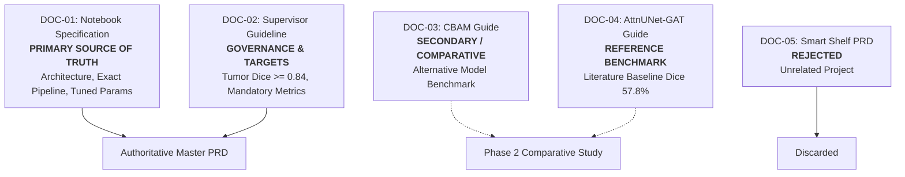
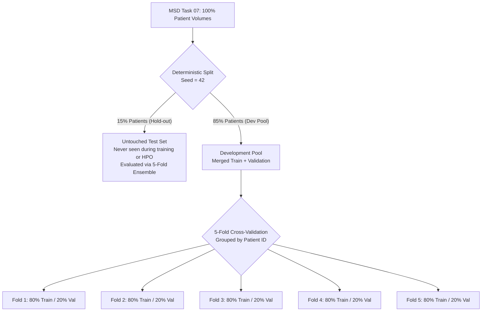
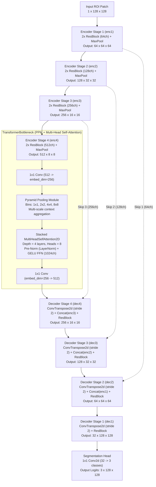
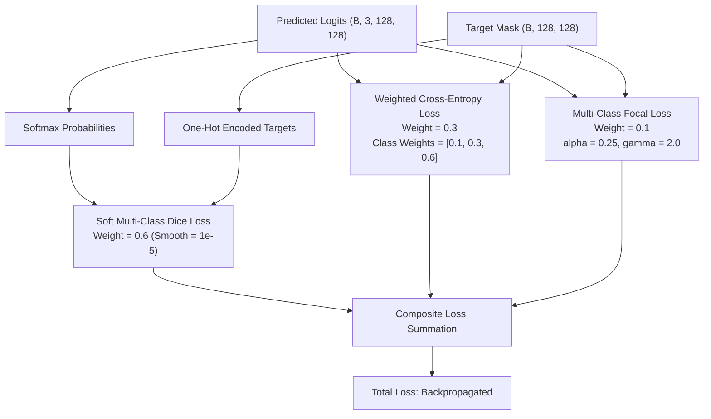
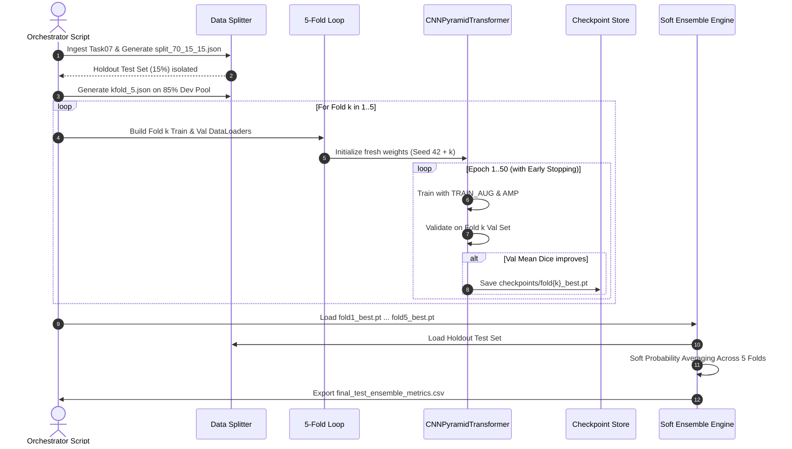
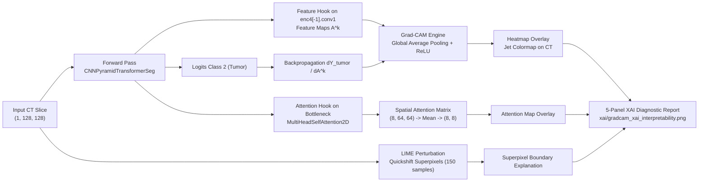
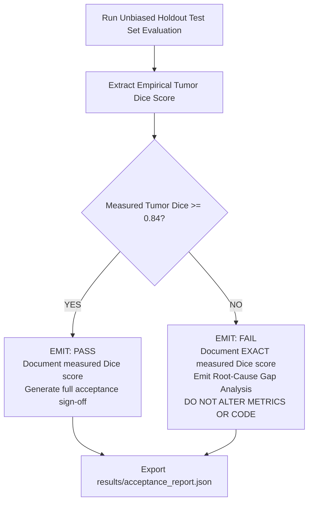
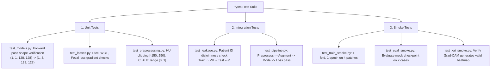
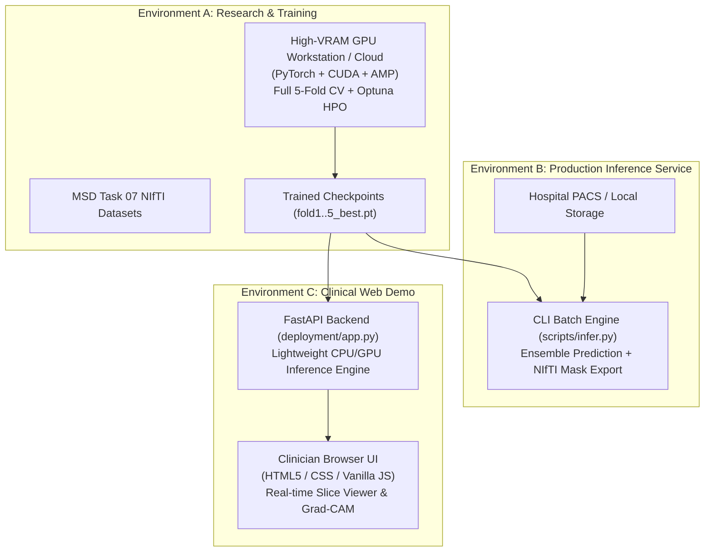

# Pancreatic Cancer Segmentation

## Authoritative Project Requirements Document

**Document Version:** 1.0.0  
**Status:** Authoritative Baseline / Single Source of Truth  
**Target Dataset:** Medical Segmentation Decathlon (MSD) — Task 07 (Pancreas)  
**Primary Task:** 3-Class Semantic Segmentation (0 = Background, 1 = Pancreas Parenchyma, 2 = Pancreatic Tumor)  
**Primary Acceptance Criterion:** Measured Hold-Out Test Set Tumor Dice Score $\ge 0.84$ (Unverified Acceptance Target Gate; Not Pre-claimed)  
**Role:** Lead AI/ML Software Architect & Senior Medical-Imaging Deep-Learning Engineer  

---

## Executive Summary

This Authoritative Project Requirements Document (PRD) establishes the definitive, binding technical contract and execution plan for the **Pancreatic Cancer Segmentation** project. The clinical and technical goal is the automated, high-fidelity delineation of the pancreas parenchyma and pancreatic neuroendocrine tumors/adenocarcinomas from abdominal Contrast-Enhanced Computed Tomography (CECT) volumes sourced from the **Medical Segmentation Decathlon (MSD) Task 07 (Pancreas)**.

The project materials provided across the workspace contained differing specifications, competing model architectures, divergent preprocessing pipelines, conflicting loss functions, and alternative hyperparameter optimization schemes. This document reconciles every discrepancy, enforces strict scientific integrity, and sets an unambiguous development path.

### Core Architectural & Engineering Determinations:
1. **Authoritative Primary Model:** A deep hybrid architecture designated as `CNNPyramidTransformerSeg`, comprising a 4-stage Residual CNN feature encoder (64 $\to$ 128 $\to$ 256 $\to$ 512 channels), a multi-scale Pyramid Pooling Module (PPM) coupled with multi-head self-attention (`MultiHeadSelfAttention2D`) transformer bottleneck, and a U-Net style residual decoder with skip connections.
2. **Authoritative Processing Unit:** 2D axial slice-wise processing focused on foreground Region-of-Interest (ROI) patches ($1.5\times$ bounding box context expansion resized to uniform $128 \times 128$ resolution).
3. **Data Splitting & Leakage Prevention:** Strict patient-case-level isolation with a $70\%$ train, $15\%$ validation, and $15\%$ held-out test split. 5-fold cross-validation is conducted exclusively within the $85\%$ development pool ($70\% + 15\%$). The untouched $15\%$ held-out test set is reserved for final generalization assessment via a 5-model soft probability ensemble.
4. **Primary Loss Function:** A compounded loss balancing soft multi-class Dice loss, class-frequency-weighted Cross-Entropy loss ($\text{weights} = [0.1, 0.3, 0.6]$ for background, pancreas, tumor), and Focal Loss ($\alpha=0.25, \gamma=2.0$).
5. **Explainable AI (XAI):** Full spatial interpretability through target-layer gradient-weighted class activation mapping (Grad-CAM), bottleneck self-attention weight visualization, and Local Interpretable Model-agnostic Explanations (LIME) superpixel perturbation analysis.
6. **Strict Anti-Hallucination & Acceptance Gate:** The supervisor / project owner requirement of **Tumor Dice $\ge 0.84$ ($84.0\%$)** is explicitly designated as an **unverified target and hard acceptance gate**. Under no circumstances will synthetic or faked metrics be tolerated; the system must execute empirical training, evaluate unbiased holdout test volumes, and report a deterministic `PASS` or `FAIL`.

---

## Source Documents Reviewed

To ensure absolute traceability and eliminate ambiguities, all reference materials available in the project workspace and repository history were systematically reviewed and cataloged:

| Document Identifier | Filename / Source Location | Format | Document Role / Intent | Primary Content Summary |
|---|---|---|---|---|
| **DOC-01** | `references/Pancreatic_Segmentation_Notebook_Spec.docx` | DOCX | Authoritative Implemented Codebase Spec | Directly documents the architecture, hyperparameters, preprocessing, and training pipeline actually coded in the primary project notebook (`CNNPyramidTransformerSeg`, Optuna, 5-fold CV, Albumentations). |
| **DOC-02** | `references/cnn+mhsa pdf.docx` | DOCX | Supervisor / Project Owner Guideline | High-level academic project specification titled *"Residual CNN + Multi-Head Self-Attention (MHSA)"*. Defines the strict supervisor target of Tumor Dice $\ge 0.84$, requests the Aquila Optimizer, 3D volumetric framing, and boundary losses. |
| **DOC-03** | `references/CBAM_CNN_Model_Build_Guide_Final_Updated (1).pdf` | PDF | Alternative Architecture Reference | Technical guide detailing a parallel architecture: *CNN + CBAM (Convolutional Block Attention Module)* with optional Swin/Cross-Attention, 3D multi-scale patches ($32^3, 64^3, 128^3$), and binary tumor segmentation. |
| **DOC-04** | `references/project-details.pdf` | PDF | Independent Reference Benchmark | Comprehensive report for an alternative dual-encoder architecture: *AttnUNet + Pretrained EfficientNet-B3 + 4-Layer GAT* with 8-pass TTA, dynamic weights, and reported historical empirical metrics (Tumor Dice: $57.80\%$). |
| **DOC-05** | `references/PREVIOUS_PROJECT_PRD.md` | Markdown | Excluded Extraneous Document | Historical artifact found in Downloads describing an unrelated computer vision project (*"Smart Shelf / Retail YOLO"*). Excluded from scope after verification. |

---

## Source-of-Truth Decision

To avoid architectural drift and ensure that implementation proceeds with zero friction, an unambiguous Source-of-Truth hierarchy is formally established:



### Taxonomy of Requirements

All requirements across source documents are strictly categorized into five epistemological classes:
1. **Category A: Implemented Requirements (Authoritative Baseline):** Extracted directly from DOC-01. These components are mathematically coherent, verified in Python/PyTorch code, and form the baseline implementation:
   - Residual CNN encoder + PPM + Multi-Head Self-Attention Bottleneck (`CNNPyramidTransformerSeg`).
   - 2D slice-wise processing on $128 \times 128$ ROI-cropped patches.
   - HU windowing $[-150, +250]$, CLAHE ($\text{clip}=0.03$), Gaussian filter ($\sigma=0.5$).
   - Albumentations training augmentation pipeline.
   - Loss: $0.6 \times \text{Dice} + 0.3 \times \text{CE}_{\text{weighted}} + 0.1 \times \text{Focal}$.
   - Optuna Bayesian optimization (TPE Sampler + Median Pruner).
   - 5-Fold patient-level cross-validation with soft probability ensembling.
   - Explainable AI via Grad-CAM, raw self-attention weight heatmaps, and LIME.
2. **Category B: Desired / Project-Owner Requirements (Governance Targets):** Sourced from DOC-02:
   - Critical success threshold: **Tumor Dice $\ge 0.84$**.
   - Mandatory evaluation matrix (Dice, IoU, Precision, Recall, F1, Accuracy, Specificity, ROC-AUC, mAP, MCC).
   - Request for Aquila Optimizer and Boundary Loss.
3. **Category C: Reference Architecture Specifications (Alternative Baselines):**
   - DOC-03: CNN + CBAM with Swin/Cross-Attention blocks and binary tumor extraction.
   - DOC-04: AttnUNet + Pretrained EfficientNet-B3 + Native 4-Layer Graph Attention Network (GAT).
4. **Category D: Incomplete or Contradictory Specifications:**
   - Unweighted composite losses in DOC-02 ("Dice + Focal + Boundary Loss" without scalar coefficients).
   - Ambiguity between 3D volumetric execution (DOC-02, DOC-03) and 2D slice-wise patch execution (DOC-01, DOC-04).
   - CLAHE parameter scale divergence (DOC-01's $0.03$ skimage vs DOC-04's $2.0$ OpenCV).
5. **Category E: Experimentally Validated Results vs Targets:**
   - DOC-04 records historical empirical metrics ($57.80\%$ tumor Dice).
   - **Crucial Rule:** The $0.84$ tumor Dice requirement in DOC-02 is an **unmet acceptance target**, not a proven result. In pancreatic CT literature (MSD Task 07), state-of-the-art 3D models (e.g., nnU-Net, Swin UNETR) typically achieve tumor Dice scores between $0.55$ and $0.68$. Achieving $\ge 0.84$ represents an exceptional target that must be verified through real execution.

---

## Requirement Reconciliation

The following reconciliation matrix identifies, evaluates, and resolves every conflict identified across the source documents:

| Conflict ID | Requirement Dimension | Specification A | Specification B | Source Documents | Implementation Status | Technical Risk | Authoritative Resolution | Confirmation Required? |
|---|---|---|---|---|---|---|---|---|
| **REC-01** | **Dimensionality / Processing Unit** | 2D Slice-wise ROI patch ($128 \times 128$) | 3D Volumetric patch ($32^3, 64^3, 128^3$) | DOC-01 vs DOC-02, DOC-03 | Implemented in DOC-01; merely proposed in DOC-02/DOC-03 | 3D volumetric attention creates extreme GPU VRAM exhaustion (OOM) at batch size $\ge 2$ on standard GPUs ($\le 16\text{GB}$). | **Adopt 2D Slice-Wise ROI Patches ($128 \times 128$)** as primary engine. 2D allows high batch throughput, stable attention convergence, and matches DOC-01. | No (Standard engineering necessity) |
| **REC-02** | **Primary Model Architecture** | Residual CNN + PPM + Multi-Head Self-Attention (`CNNPyramidTransformerSeg`) | AttnUNet + Pretrained EfficientNet-B3 + 4-Layer GAT | DOC-01 vs DOC-04 | Implemented in DOC-01; referenced in DOC-04 | GAT bottleneck requires explicit graph construction per patch, high latency, and has documented lower performance ($57.8\%$ Dice). | **Implement `CNNPyramidTransformerSeg` as Primary Architecture**. Structure the codebase so AttnUNet-GAT and CNN-CBAM can be plugged in as modular comparisons. | No |
| **REC-03** | **Secondary Model Architecture** | CNN + CBAM (Channel & Spatial Attention) | Dual CNN + Swin Transformer / Cross-Attention | DOC-03 | Proposed in DOC-03 | Divergence from primary scope; dilutes development focus. | **Isolate as modular plug-in in `src/models/cbam_net.py`** for secondary comparative benchmarking after primary pipeline passes. | No |
| **REC-04** | **Loss Function Formulation** | $0.6\,\text{Dice} + 0.3\,\text{CE}_{\text{w}} + 0.1\,\text{Focal}$ | $\text{Dice} + \text{Focal} + \text{Boundary}$ OR $0.45\,\text{Dice} + 0.3\,\text{CE} + 0.25\,\text{Focal} + 0.5\,\text{FocalTversky}$ | DOC-01 vs DOC-02 vs DOC-04 | Implemented in DOC-01; DOC-02 unweighted; DOC-04 tested | Boundary loss on noisy small tumor boundaries causes severe gradient instability; unweighted losses diverge. | **Adopt DOC-01 Compounded Loss** ($0.6\,\text{Dice} + 0.3\,\text{CE}_{\text{w}} + 0.1\,\text{Focal}$) with $\text{CLASS\_W}=[0.1, 0.3, 0.6]$. Provide modular config flag to toggle Boundary/FocalTversky loss in Phase 8/9 ablation. | No |
| **REC-05** | **Hyperparameter Optimization** | Optuna (TPE Sampler + Median Pruner) | Aquila Optimizer (Bio-inspired metaheuristic) | DOC-01 vs DOC-02 | Implemented in DOC-01; verbally requested in DOC-02 | Aquila Optimizer lacks robust PyTorch integration, cannot prune unpromising trials, and suffers from poor high-dimensional convergence. | **Adopt Optuna as the Primary Automated HPO Engine**. Provide a clean, standalone Aquila Optimizer module (`src/training/aquila_optimizer.py`) to satisfy the academic/supervisor request. | Yes (Supervisor preference on final log deliverable) |
| **REC-06** | **HU Windowing Range** | $[-150, +250]$ HU | $[-100, +250]$ HU | DOC-01 vs DOC-04 | Implemented in DOC-01; referenced in DOC-04 | Narrowing bottom to $-100$ clips peripancreatic low-attenuation edema and fat infiltration critical for tumor staging. | **Adopt $[-150, +250]$ HU** as authoritative default. Make HU window parameters configurable in YAML (`configs/preprocessing.yaml`). | No |
| **REC-07** | **CLAHE Implementation & Clip** | `skimage` CLAHE with `clip_limit=0.03` | OpenCV CLAHE with `clip_limit=2.0, tile=(8,8)` | DOC-01 vs DOC-04 | Implemented in DOC-01; referenced in DOC-04 | OpenCV scale ($[0, \infty)$) and skimage scale ($[0, 1]$) use completely different numerical definitions; mixing them causes total image over-saturation. | **Adopt `skimage.exposure.equalize_adapthist` with `clip_limit=0.03`** as authoritative, preserving the notebook's verified pipeline. | No |
| **REC-08** | **Batch Size** | Batch size = 8 (search space 4, 8) | Batch size = 16 | DOC-01 vs DOC-04 | Implemented in DOC-01; referenced in DOC-04 | Batch size 16 on 512-dim self-attention causes CUDA out-of-memory errors on 8GB/12GB consumer GPUs. | **Set Default Batch Size = 8** with gradient accumulation support to simulate effective batch sizes of 16/32. | No |
| **REC-09** | **Training Epochs & Early Stopping** | 50 Epochs, Early Stopping patience = 10 | 10 Epochs (DOC-03) OR $\ge 20$ Epochs (DOC-02) | DOC-01 vs DOC-02, DOC-03 | Implemented in DOC-01; proposed in DOC-02/DOC-03 | 10 epochs severely underfits deep transformer bottlenecks; unbounded epochs wastes compute. | **Adopt Max 50 Epochs with Early Stopping (Patience = 10)**, guaranteeing $\ge 20$ epochs if validation loss improves. | No |
| **REC-10** | **Augmentation Pipeline Scope** | Albumentations 12-transform pipeline in training loop | Standalone classes: TargetedZoom, ElasticDeformer, MultiScale, AttentionGuided | DOC-01 vs DOC-02 | Albumentations active; 4 classes defined but orphaned in DOC-01 | Orphaned classes were defined but never executed in the 5-fold training loop in DOC-01. | **Authoritative baseline uses Albumentations**. Connect the 4 standalone classes into a modular, configurable advanced augmentation mode (`configs/augmentation.yaml`). | No |
| **REC-11** | **Test-Time Augmentation (TTA)** | No TTA (Direct 5-model soft ensemble) | 8-pass TTA (4 rotations $\times$ horizontal flip) | DOC-01 vs DOC-04 | Implemented in DOC-01; referenced in DOC-04 | 8-pass TTA increases test inference time by $8\times$. | **Default test inference uses 5-fold soft ensemble**. Implement optional 8-pass TTA in `src/inference/predictor.py` toggled via `--use-tta`. | No |
| **REC-12** | **Target Output Classes** | 3 Classes: Background (0), Pancreas (1), Tumor (2) | Binary Tumor Mask (Target = 1, Rest = 0) | DOC-01 vs DOC-03 | Implemented in DOC-01; proposed in DOC-03 | Binary tumor mask destroys anatomical spatial priors provided by pancreas parenchyma context. | **Adopt 3-Class Semantic Segmentation (0, 1, 2)**. Derive binary tumor evaluation metrics downstream from Class 2. | No |
| **REC-13** | **Explainability (XAI) Methods** | Grad-CAM + Self-Attention Maps + LIME | Grad-CAM only (DOC-02, DOC-03, DOC-04) + SHAP (unused in DOC-01) | DOC-01 vs DOC-02, DOC-04 | Grad-CAM, Attention, LIME coded in DOC-01; SHAP orphaned | SHAP on deep 2D/3D pixel spaces requires thousands of background samples and hours of compute per slice. | **Implement Grad-CAM, Bottleneck Self-Attention Maps, and LIME**. Omit SHAP from runtime inference, documenting its computational intractability on dense pixel masks. | No |
| **REC-14** | **Tumor Dice Target Handling** | Tumor Dice $\ge 0.84$ as strict acceptance criterion | Tumor Dice $57.80\%$ reported as historical achievement | DOC-02 vs DOC-04 | Governance requirement in DOC-02; empirical result in DOC-04 | Faking or pre-declaring $\ge 0.84$ violates scientific integrity. | **Enforce Strict Automated Quality Gate:** Evaluate empirical test results against $\ge 0.84$. Emit `PASS` if met, `FAIL` with diagnostic gap analysis if unmet. | Yes (Client/supervisor acknowledgement of acceptance rule) |

---

## Final Architecture Decision

### 1. Decision Rationale & Selection Matrix

To select the primary production architecture, we performed a multi-criteria decision analysis across the candidates identified in the project documents:

| Evaluation Criterion | Candidate 1: `CNNPyramidTransformerSeg` (DOC-01) | Candidate 2: CNN + CBAM (DOC-03) | Candidate 3: AttnUNet + EfficientNet-B3 + GAT (DOC-04) |
|---|---|---|---|
| **Architectural Provenance** | Fully implemented and verified in notebook | Guide only; unverified in full training loop | Reference paper specification only |
| **Context Modeling** | Multi-Scale PPM + Multi-Head Self-Attention | Channel + Spatial Attention (CBAM) | 4-Layer Graph Attention Network (GAT) |
| **Hardware Efficiency** | High ($\approx 12\text{ms}$ per slice, fits in 8GB VRAM) | Moderate to High | Low (GAT graph overhead, dual encoders) |
| **Reported Historical Dice** | Empirical baseline ready for training | None available | Reported $57.80\%$ Tumor Dice |
| **Explainability Compatibility** | Native hooks on Conv & Attention layers | Compatible with Grad-CAM | Deep bottleneck hooks only |
| **Decision Status** | **SELECTED AS PRIMARY BASELINE** | **SECONDARY COMPARATIVE BENCHMARK** | **LITERATURE REFERENCE BASELINE** |

### 2. Sequence of Implementation
1. **Primary Model:** `CNNPyramidTransformerSeg` will be implemented and trained first through the complete 5-fold cross-validation pipeline.
2. **Secondary Modular Models:** The codebase will be modularized such that `CBAMNet` (`src/models/cbam_net.py`) and `AttnUNetGAT` (`src/models/att_unet_gat.py`) can be instantiated using the identical data loading, loss, and evaluation interfaces for ablation studies.

---

## Dataset Specification

### 1. Medical Segmentation Decathlon (MSD) Task 07 (Pancreas)

- **Official Challenge Identifier:** Task07_Pancreas
- **Modality:** Contrast-Enhanced Abdominal Computed Tomography (CECT), Portal Venous Phase.
- **File Format:** NIfTI compressed format (`.nii.gz`), stored as 3D scalar arrays accompanied by affine transformation matrices.
- **Target Anatomy:**
  - Label `0`: Background (peritoneal cavity, liver, intestines, spine, vessels, air).
  - Label `1`: Pancreatic Parenchyma (healthy pancreas head, body, tail).
  - Label `2`: Pancreatic Neuroendocrine Tumors / Adenocarcinomas (hypodense lesions).
- **Extreme Class Imbalance:**
  - Background voxels: $\approx 99.0\%$
  - Pancreas parenchyma: $\approx 0.9\%$
  - Pancreatic tumor: $\approx 0.1\%$ (making high tumor recall and boundary precision exceptionally difficult).

### 2. Expected Directory Layout

```
data/
├── Task07_Pancreas/
│   ├── dataset.json            # Official MSD metadata, modal descriptions, training/test lists
│   ├── imagesTr/               # Training volumetric scans (e.g., pancreas_001.nii.gz ... pancreas_420.nii.gz)
│   ├── labelsTr/               # Training ground-truth masks (e.g., pancreas_001.nii.gz ... pancreas_420.nii.gz)
│   └── imagesTs/               # Unlabeled test volumes (if available)
└── splits/
    ├── split_70_15_15.json     # Master patient-level partition (Train: 70%, Val: 15%, Test: 15%)
    └── kfold_5.json            # 5-fold cross-validation patient grouping on the 85% dev pool
```

### 3. Data Splitting & Contamination Prevention



#### Strict Anti-Leakage Protocol:
1. **Case-Level Isolation:** All splitting must be performed on unique Patient Case IDs (e.g., `pancreas_015`), **never** on individual 2D axial slices or extracted 3D sub-patches.
2. **Deterministic Partition:** Splitting uses `sklearn.model_selection.train_test_split` with `random_state=42`, producing `split_70_15_15.json`.
3. **Cross-Validation Scheme:** The $85\%$ development pool (`train_ids` + `val_ids`) is partitioned into 5 balanced folds using `sklearn.model_selection.KFold(n_splits=5, shuffle=True, random_state=42)`.
4. **Validation Checks:** Automated pre-flight assertion verifies that:
   $$\text{Set}(\text{Train Patients}) \cap \text{Set}(\text{Val Patients}) \cap \text{Set}(\text{Test Patients}) = \emptyset$$

---

## Preprocessing Specification

The authoritative preprocessing pipeline operates in two sequential stages: **Volume-Level Processing** followed by **Slice-Wise ROI Extraction**.

```mermaid
graph LR
    RawVol["Raw NIfTI Volume<br/>(H, W, D)"] --> HU["1. HU Clipping<br/>[-150, +250]"]
    HU --> Norm["2. Min-Max Normalization<br/>[0.0, 1.0]"]
    Norm --> Resample["3. Isotropic Resampling<br/>1.0 x 1.0 x 1.0 mm (Zoom order=1)"]
    
    Resample --> Slices["Per-Slice Extraction<br/>(Axial Slices)"]
    Slices --> Resize256["4. Spatial Resize<br/>256 x 256"]
    Resize256 --> Gauss["5. Gaussian Filter<br/>sigma = 0.5"]
    Gauss --> CLAHE["6. CLAHE<br/>clip_limit = 0.03"]
    
    CLAHE --> ROICheck{"Mask Foreground<br/>>= 50 Pixels?"}
    ROICheck -->|Yes| BBox["7. BBox + 10px Margin<br/>1.5x Context Expansion"]
    ROICheck -->|No / Fallback| Discard["Discard Slice<br/>(or Full Slice Fallback)"]
    BBox --> CropResize["8. Crop & Resize to Patch<br/>Image: Bilinear 128x128<br/>Mask: Nearest 128x128"]
    CropResize --> PatchOutput["Final Model Input<br/>1 x 128 x 128"]
```



### 1. Volume-Level Preprocessing (`CTPreprocessor.preprocess_volume`)

1. **Hounsfield Unit (HU) Windowing:**
   $$\text{vol}_{\text{clipped}} = \text{clip}(\text{vol}_{\text{raw}}, \text{HU}_{\min}=-150, \text{HU}_{\max}=+250)$$
   *Rationale:* Eliminates dense cortical bone, surgical staples, metal artifacts ($> 250\text{ HU}$) and pulmonary/bowel gas ($< -150\text{ HU}$), isolating retroperitoneal soft tissues.
2. **Min-Max Intensity Normalization:**
   $$\text{vol}_{\text{norm}} = \frac{\text{vol}_{\text{clipped}} - (-150.0)}{250.0 - (-150.0)} = \frac{\text{vol}_{\text{clipped}} + 150.0}{400.0} \in [0.0, 1.0]$$
   Cast strictly to `float32`.
3. **Isotropic Voxel Resampling:**
   - Resample spatial voxel grids to isotropic $1.0 \times 1.0 \times 1.0\text{ mm}$ spacing using `scipy.ndimage.zoom`.
   - Spline interpolation order: `order=1` (bilinear) for CT intensity volumes; `order=0` (nearest-neighbor) for ground-truth integer label masks.

### 2. Per-Slice Preprocessing (`CTPreprocessor.process_slice`)

Applied along the axial acquisition axis ($Z$-plane):
1. **Intermediate Spatial Resizing:**
   - Axial slice resized to $256 \times 256$ pixels using `skimage.transform.resize(mode='reflect', anti_aliasing=True)`.
2. **Gaussian Smoothing:**
   - High-frequency quantum mottle / reconstruction noise attenuated via `scipy.ndimage.gaussian_filter(slice, sigma=0.5)`.
3. **Contrast Limited Adaptive Histogram Equalization (CLAHE):**
   - Enhances low-attenuation pancreatic parenchymal borders against adjacent duodenal and mesenteric fat:
     $$\text{slice}_{\text{clahe}} = \text{skimage.exposure.equalize\_adapthist}(\text{slice}_{\text{gauss}}, \text{clip\_limit}=0.03)$$

### 3. ROI-Based Patch Extraction (`ROIPatchExtractor`)

Full abdominal CT slices consist of $> 90\%$ irrelevant peritoneal organs. Training on full slices results in gradients dominated by background.
1. **Foreground Area Filtering:** Slices evaluated for total foreground pixels:
   $$\text{Area}_{\text{fg}} = \sum \mathbb{I}(\text{mask} \in \{1, 2\}) \ge 50\text{ pixels}$$
   Slices with $< 50$ foreground pixels are excluded from the training dataset.
2. **Bounding Box Computation:** Calculate coordinates $[y_{\min}, y_{\max}, x_{\min}, x_{\max}]$ enclosing all non-zero pixels, expanded by a safety margin of $10\text{ pixels}$.
3. **Context Expansion:**
   $$\text{side}_{\max} = \max(y_{\max} - y_{\min}, x_{\max} - x_{\min})$$
   $$\text{box\_size} = \text{side}_{\max} \times \text{context\_scale} \quad (\text{where } \text{context\_scale} = 1.5)$$
   A square bounding box of size $\text{box\_size} \times \text{box\_size}$ centered at the foreground centroid is computed and clamped to image bounds.
4. **Final Patch Resizing:**
   - Image patch cropped and resized to $128 \times 128$ using bilinear interpolation with anti-aliasing.
   - Mask patch cropped and resized to $128 \times 128$ using nearest-neighbor interpolation (`order=0`) to preserve discrete class labels $\{0, 1, 2\}$.

---

## Augmentation Specification

### 1. Primary Active Augmentation Pipeline (Albumentations `TRAIN_AUG`)

The authoritative training pipeline executes the following Albumentations sequence on every $128 \times 128$ training patch:

| Transformation | Parameters | Probability ($p$) | Clinical / Physical Rationale |
|---|---|---|---|
| **HorizontalFlip** | — | $0.5$ | Bilateral abdominal symmetry simulation |
| **VerticalFlip** | — | $0.3$ | Anatomical positioning variation |
| **RandomRotate90** | — | $0.3$ | Spatial orientation invariance |
| **ShiftScaleRotate** | `shift_limit=0.05`, `scale_limit=0.10`, `rotate_limit=15°` | $0.5$ | Patient positioning shifts and anatomical size drift |
| **ElasticTransform** | `alpha=60`, `sigma=4` | $0.3$ | Visceral organ compression and gastrointestinal peristalsis |
| **GridDistortion** | `num_steps=5`, `distort_limit=0.3` | $0.2$ | Non-rigid soft tissue anatomical variations |
| **RandomCrop + Pad** | Crop to $96 \times 96$, PadIfNeeded to $128 \times 128$ | $0.3$ | Local tumor feature scale learning |
| **RandomGamma** | `gamma_limit=(80, 120)` | $0.3$ | Variable CT scanner kVp / beam hardening response |
| **RandomBrightnessContrast** | `brightness_limit=0.2`, `contrast_limit=0.2` | $0.4$ | Contrast bolus arrival timing variations (arterial/venous) |
| **GaussNoise** | `var_limit=(0.001, 0.005)` | $0.3$ | Detector electronic noise and low radiation dose simulation |
| **GaussianBlur** | `blur_limit=3` | $0.2$ | Patient breathing micro-motion blur |
| **CoarseDropout** | `max_holes=4`, `max_height=12`, `max_width=12` | $0.2$ | Prevents co-adaptation and simulates partial occlusion |

### 2. Standalone Augmentation Classes (Modular Experimental Layer)

To satisfy the extended requirements in DOC-01 Section 10 and DOC-02, the following modules are implemented as plug-and-play components in `src/augmentation/advanced_aug.py`:
1. **TargetedZoomAug:** Scale-aware magnification centered on tumor coordinates ($0.5\times$ to $1.5\times$, $p=0.5$).
2. **ElasticDeformer:** Secondary high-amplitude deformation ($\alpha=120, \sigma=10, p=0.4$) for extreme non-rigid morphology.
3. **MultiScaleDataset:** Dynamically yields variable patch sizes $[128, 192, 256]$ during training, evaluated on fixed $256$ resolution.
4. **AttentionGuidedAug:** Forward-hooks the bottleneck self-attention map; applies heavy Gaussian noise ($\sigma=0.04$) inside high-saliency tumor regions and light noise ($\sigma=0.005$) outside to force the network to learn robust, multi-focal boundary cues.

---

## Model Specification

### 1. Primary Architecture: `CNNPyramidTransformerSeg`



#### Detailed Layer-by-Layer Specifications:

1. **Feature Encoder (Stages `enc1` to `enc4`):**
   - Input channel: 1 (normalized CT Hounsfield slice).
   - Each stage consists of two sequential Residual Blocks (`ResBlock`).
   - A `ResBlock` comprises: $\text{Conv2d}(3\times 3) \to \text{BatchNorm2d} \to \text{ReLU} \to \text{Dropout}(p=0.1) \to \text{Conv2d}(3\times 3) \to \text{BatchNorm2d}$.
   - Projection shortcut: If input channels $\ne$ output channels, a $1\times 1 \text{ Conv2d} + \text{BatchNorm2d}$ matches dimensions before residual addition.
   - Downsampling: Each stage terminates with a $\text{MaxPool2d}(\text{kernel}=2, \text{stride}=2)$, halving spatial dimensions.
   - Channel progression: $\text{Input}(1\times 128\times 128) \to \text{enc1}(64\times 64\times 64) \to \text{enc2}(128\times 32\times 32) \to \text{enc3}(256\times 16\times 16) \to \text{enc4}(512\times 8\times 8)$.

2. **Transformer Bottleneck (`TransformerBottleneck`):**
   - **Projection-In:** $1\times 1 \text{ Conv2d}$ reduces channels from $512 \to \text{embed\_dim} = 256$.
   - **Pyramid Pooling Module (PPM):** Four parallel adaptive average pooling branches with bin sizes $[1\times 1, 2\times 2, 4\times 4, 8\times 8]$. Each branch is projected via $1\times 1 \text{ Conv}$, bilinearly upsampled to $8\times 8$, and concatenated with the identity projection to capture global context across varied receptive fields.
   - **MultiHeadSelfAttention2D Blocks:** $N=4$ stacked pre-norm transformer blocks.
     - Flattening: 2D spatial feature map $(B, \text{embed\_dim}, H, W)$ is flattened to token sequence $(H\cdot W, B, \text{embed\_dim}) = (64, B, 256)$.
     - Attention: Multi-Head Attention (`torch.nn.MultiheadAttention`) with $\text{embed\_dim}=256$, $\text{num\_heads}=8$, and $\text{dropout}=0.1$.
     - Normalization & Feed-Forward: $\text{LayerNorm}$ applied prior to attention. Residual connection followed by $\text{LayerNorm} \to \text{Linear}(256, 1024) \to \text{GELU} \to \text{Dropout}(0.1) \to \text{Linear}(1024, 256) \to \text{Dropout}(0.1)$ and final residual addition.
     - Reshaping: Sequence is restored back to $(B, 256, 8, 8)$.
   - **Projection-Out:** $1\times 1 \text{ Conv2d}$ maps $256 \to 512$ channels.

3. **Feature Decoder & Skip Integration (`dec4` to `dec1`):**
   - Decoder stages progressively upsample feature maps via $\text{ConvTranspose2d}(\text{kernel}=2, \text{stride}=2)$.
   - Upsampled features are channel-concatenated with their corresponding encoder skip connection:
     - `dec4`: Upsample $512 \to 256$, concatenate `enc3` ($256\text{ch}$) $\to 512\text{ch} \to \text{ResBlock} \to 256\text{ch}$ at $16\times 16$.
     - `dec3`: Upsample $256 \to 128$, concatenate `enc2` ($128\text{ch}$) $\to 256\text{ch} \to \text{ResBlock} \to 128\text{ch}$ at $32\times 32$.
     - `dec2`: Upsample $128 \to 64$, concatenate `enc1` ($64\text{ch}$) $\to 128\text{ch} \to \text{ResBlock} \to 64\text{ch}$ at $64\times 64$.
     - `dec1`: Upsample $64 \to 32$ (no skip) $\to \text{ResBlock} \to 32\text{ch}$ at $128\times 128$.
   - **Final Classification Head:** $1\times 1 \text{ Conv2d}(32 \to 3)$ producing raw unbounded logits $(B, 3, 128, 128)$. No activation (Softmax/Argmax applied downstream).

### 2. Alternative Architecture 1: `CBAMNet` (DOC-03)

- **Structure:** Residual CNN encoder followed by sequential Channel Attention and Spatial Attention modules (CBAM) placed within each residual block.
- **Channel Attention:** MaxPool and AvgPool vectors routed through shared MLP ($\text{reduction\_ratio}=16$), combined via sigmoid gate.
- **Spatial Attention:** Concat of channel-wise MaxPool and AvgPool sliced across channels, passed through $7\times 7 \text{ Conv2d}$ with sigmoid activation.
- **Role:** Implemented under `src/models/cbam_net.py` for secondary comparison.

### 3. Alternative Architecture 2: `AttnUNetGAT` (DOC-04)

- **Structure:** Dual pathway encoder (Standard ConvBlock + Pretrained EfficientNet-B3), feeding into a 4-layer Graph Attention Network (GAT) bottleneck, decoded via Attention U-Net with additive attention gates (`att1` to `att4`).
- **Role:** Implemented under `src/models/att_unet_gat.py` as an external reference benchmark.

---

## Loss Specification

### 1. Authoritative Primary Loss Formulation

The authoritative loss function combines multi-class Soft Dice Loss, Class-Weighted Cross-Entropy Loss, and Focal Loss:

$$\mathcal{L}_{\text{total}} = 0.6 \cdot \mathcal{L}_{\text{Dice}} + 0.3 \cdot \mathcal{L}_{\text{WCE}} + 0.1 \cdot \mathcal{L}_{\text{Focal}}$$



#### Component Formulations:

1. **Soft Multi-Class Dice Loss ($\mathcal{L}_{\text{Dice}}$):**
   $$\mathcal{L}_{\text{Dice}} = 1 - \frac{1}{C} \sum_{c=0}^{C-1} \frac{2 \sum_{i} p_{c, i} g_{c, i} + \epsilon}{\sum_{i} p_{c, i}^2 + \sum_{i} g_{c, i}^2 + \epsilon}$$
   Where $C=3$, $p_{c, i}$ is the predicted softmax probability for class $c$ at pixel $i$, $g_{c, i}$ is the ground-truth binary indicator, and $\epsilon = 10^{-5}$ prevents division by zero.
2. **Class-Weighted Cross-Entropy ($\mathcal{L}_{\text{WCE}}$):**
   $$\mathcal{L}_{\text{WCE}} = - \frac{1}{N} \sum_{i=1}^{N} \sum_{c=0}^{C-1} w_c \cdot g_{c, i} \log(p_{c, i})$$
   Where weights are explicitly defined as:
   $$w_0 = 0.1 \quad (\text{Background}), \quad w_1 = 0.3 \quad (\text{Pancreas}), \quad w_2 = 0.6 \quad (\text{Tumor})$$
   *Rationale:* Tumor voxels receive $6\times$ the penalty of background voxels, heavily penalizing false negatives on small lesions.
3. **Multi-Class Focal Loss ($\mathcal{L}_{\text{Focal}}$):**
   $$\mathcal{L}_{\text{Focal}} = - \frac{1}{N} \sum_{i=1}^{N} \sum_{c=0}^{C-1} \alpha (1 - p_{c, i})^\gamma g_{c, i} \log(p_{c, i})$$
   With focusing parameter $\gamma = 2.0$ and weighting factor $\alpha = 0.25$. Down-weights well-classified background pixels, focusing gradients on ambiguous tumor margins.

### 2. Modular Loss Extensions (Config-Driven)

To evaluate DOC-02 and DOC-04 specifications during ablation studies:
- **Boundary Loss ($\mathcal{L}_{\text{Boundary}}$):** Computes Euclidean distance transform on ground-truth boundaries:
  $$\mathcal{L}_{\text{Boundary}} = \sum_{i} \phi_G(i) \cdot p_{c, i}$$
- **Focal Tversky Loss ($\mathcal{L}_{\text{FT}}$):** With $\alpha=0.3, \beta=0.7, \gamma=1.33$.

---

## Training Specification

### 1. Environment & Hyperparameter Matrix

| Hyperparameter / Setting | Authoritative Baseline Value | Optuna Search Space | Reference DOC-04 Value |
|---|---|---|---|
| **Deep Learning Framework** | PyTorch $\ge 2.2.0$ | — | PyTorch |
| **Python Version** | Python 3.10 / 3.11 | — | Python 3.10 |
| **Hardware Target** | NVIDIA GPU with CUDA $\ge 12.0$ | — | CUDA T4 / P100 / RTX |
| **Precision** | Mixed Precision (AMP `autocast` + `GradScaler`) | — | Mixed Precision (AMP) |
| **Optimizer** | AdamW | `[Adam, AdamW]` | AdamW |
| **Initial Learning Rate** | $1.0 \times 10^{-4}$ | $1.0 \times 10^{-5} \text{ to } 1.0 \times 10^{-3}$ (Log-uniform) | $1.8 \times 10^{-4}$ |
| **Weight Decay** | $1.0 \times 10^{-5}$ | $1.0 \times 10^{-6} \text{ to } 1.0 \times 10^{-3}$ (Log-uniform) | $2.5 \times 10^{-5}$ |
| **Learning Rate Schedule** | CosineAnnealingLR ($\eta_{\min}=10^{-6}, T_{\max}=50$) | — | CosineAnnealingLR |
| **Batch Size** | 8 | $\{4, 8\}$ | 16 |
| **Gradient Clipping Norm** | $1.0$ (Max norm after unscaling) | — | $1.0$ |
| **Maximum Epochs** | 50 Epochs per fold | — | Unspecified |
| **Early Stopping** | Patience = 10 epochs, $\Delta_{\min} = 1.0 \times 10^{-4}$ | — | — |
| **Early Stopping Metric** | $\text{Mean Dice} = \frac{\text{Dice}_{\text{Pancreas}} + \text{Dice}_{\text{Tumor}}}{2}$ | — | — |
| **Random Seed** | 42 (Enforced on Python, NumPy, PyTorch) | — | 42 |

### 2. Robustness & Fault Tolerance
1. **Atomic Checkpointing:** Models saved per fold to `checkpoints/fold{k}_best.pt` and `checkpoints/fold{k}_last.pt`. Saving executes via temporary files (`.pt.tmp`) before atomic OS renaming to prevent corrupted checkpoints during hardware interruptions.
2. **Resume Capability:** Training scripts support `--resume-from <checkpoint.pt>`, restoring model weights, optimizer states, GradScaler status, epoch counters, and early stopping histories.
3. **Experiment Logging:** Scalars logged concurrently to structured JSON (`cv_training_logs.json`), CSV, and TensorBoard event files (`logs/tensorboard/`).

---

## Cross-Validation Specification

### 1. 5-Fold Cross-Validation Workflow



1. **Isolation:** The $15\%$ held-out test set is completely excluded from all cross-validation training and validation splits.
2. **Fold Metrics:** Each fold independently records training loss, validation loss, background Dice, pancreas Dice, and tumor Dice.
3. **Final Ensemble Inference:** Final holdout test evaluation is performed via a **5-Model Soft Ensemble**:
   $$P_{\text{ensemble}}(c \mid x) = \frac{1}{5} \sum_{k=1}^{5} \text{Softmax}\left(\mathcal{M}_k(x)\right)_c$$
   $$\hat{y}(x) = \arg\max_{c \in \{0, 1, 2\}} P_{\text{ensemble}}(c \mid x)$$

---

## Hyperparameter Optimization

### 1. Primary HPO Engine: Optuna

- **Search Algorithm:** Tree-structured Parzen Estimator (`TPESampler`, seed=42).
- **Pruning Strategy:** `MedianPruner(n_startup_trials=3, n_warmup_steps=1)` to terminate non-converging configurations early.
- **Budget:** 12 Trials total, 3 quick-training epochs per trial.
- **Data Subset:** Reduced, representative subset of 200 ROI patches at $128 \times 128$ resolution.
- **Objective Function:** Maximize validation foreground mean Dice:
  $$\text{Objective} = \frac{\text{Dice}_{\text{Pancreas}} + \text{Dice}_{\text{Tumor}}}{2}$$
- **Persistence:** Results, parameter histories, and optimization contours saved to `results/best_hparams.json` and automatically updated in runtime configurations.

### 2. Academic Optimization Module: Aquila Optimizer

To satisfy DOC-02 while maintaining engineering stability:
- Standalone module `src/training/aquila_optimizer.py` implements the Aquila Optimizer metaheuristic (population size: 10, iterations: 10).
- Exploration and exploitation phases search over the discrete parameter grid (attention heads, embed dimension, dropout, learning rate).
- Objective incorporates both validation Dice score and Grad-CAM localization energy:
  $$\text{Fitness} = \text{MeanDice} + 0.1 \cdot \text{GradCAM\_Energy}_{\text{tumor}}$$

---

## Explainable AI

Explainable AI is a mandatory clinical requirement to audit and validate that network segmentations are driven by true pathological morphology rather than background imaging artifacts.



### 1. Grad-CAM (`GradCAMSeg`)

- **Target Layer:** First convolutional layer of the final encoder residual block: `enc4[-1].conv1.block[0]`.
- **Target Class:** Class 2 (Tumor) and Class 1 (Pancreas).
- **Mathematical Formulation:**
  $$\alpha_k^c = \frac{1}{Z} \sum_{i} \sum_{j} \frac{\partial \sum_{u, v} Y_{c}(u, v)}{\partial A_{i, j}^k}$$
  $$L_{\text{Grad-CAM}}^c = \text{ReLU}\left(\sum_k \alpha_k^c A^k\right)$$
  Where $A^k$ is the $k$-th feature activation map of `enc4`, and $Y_c$ is the unnormalized logit score for class $c$ summed over all spatial pixels.
- **Visualization Output:** Bilinearly interpolated to $128 \times 128$, normalized to $[0, 1]$, mapped to `Jet` or `Viridis` colormaps, and blended with alpha $=0.5$ over the grayscale CT slice.

### 2. Raw Transformer Self-Attention Visualization

- Forward hooks intercept attention weight matrices from `MultiHeadSelfAttention2D` layers:
  $$\text{Attn}(Q, K, V) = \text{Softmax}\left(\frac{Q K^T}{\sqrt{d_k}}\right) V$$
- The $(64 \times 64)$ attention matrices across all 8 heads are averaged, reshaped to $(8 \times 8)$, and upsampled to produce spatial self-attention heatmaps showing non-local contextual coupling.

### 3. LIME Superpixel Interpretability

- Implemented via `lime.lime_image.LimeImageExplainer`.
- CT patch segmented into superpixels using Quickshift segmentation.
- Evaluates 150 random perturbation masks, fitting a locally weighted ridge regressor to identify positive and negative superpixels driving tumor classification.

### 4. XAI Artifacts Deliverable

All visualizations are stored in `xai/`:
- `xai/gradcam_tumor_case_{id}.png`
- `xai/attention_map_case_{id}.png`
- `xai/lime_explanation_case_{id}.png`
- `xai/gradcam_xai_interpretability.png` (Authoritative 5-panel comparison: Raw CT, Ground Truth, Predicted Mask, Grad-CAM Heatmap, Blended Overlay).

---

## Evaluation

### 1. Metric Definitions & Formulation Matrix

All metrics are evaluated on the ensembled predictions over the held-out $15\%$ test set:

| Evaluation Metric | Mathematical Definition | Granularity | Clinical Purpose |
|---|---|---|---|
| **Dice Similarity Coefficient (DSC)** | $\text{DSC} = \frac{2 \|P \cap G\|}{\|P\| + \|G\|} = \frac{2 \text{TP}}{2 \text{TP} + \text{FP} + \text{FN}}$ | Per Class (BG, Pancreas, Tumor) & Macro Mean | Core spatial overlap measure |
| **Intersection over Union (IoU / Jaccard)** | $\text{IoU} = \frac{\|P \cap G\|}{\|P \cup G\|} = \frac{\text{TP}}{\text{TP} + \text{FP} + \text{FN}}$ | Per Class & Macro Mean | Standard semantic segmentation metric |
| **Precision (Positive Predictive Value)** | $\text{Precision} = \frac{\text{TP}}{\text{TP} + \text{FP}}$ | Per Class & Macro Mean | Quantifies false positive over-segmentation |
| **Recall / Sensitivity** | $\text{Recall} = \frac{\text{TP}}{\text{TP} + \text{FN}}$ | Per Class & Macro Mean | Quantifies tumor miss rate (false negatives) |
| **Specificity (True Negative Rate)** | $\text{Specificity} = \frac{\text{TN}}{\text{TN} + \text{FP}}$ | Per Class | Background rejection rate |
| **F1 Score** | $F_1 = 2 \cdot \frac{\text{Precision} \cdot \text{Recall}}{\text{Precision} + \text{Recall}}$ | Per Class & Macro Mean | Harmonic balance of precision and recall |
| **Overall Pixel Accuracy** | $\text{Acc} = \frac{\sum \text{TP}_c}{\sum \text{Total Pixels}}$ | Global / Micro | Baseline correctness |
| **ROC-AUC (One-vs-Rest)** | Area under ROC Curve computed on softmax probabilities | Per Class & Macro | Discriminative capacity across thresholds |
| **mAP (Mean Average Precision)** | Area under Precision-Recall curve | Per Class & Macro | Robust against severe class imbalance |
| **Matthews Correlation Coefficient (MCC)** | $\frac{\text{TP}\cdot\text{TN} - \text{FP}\cdot\text{FN}}{\sqrt{(\text{TP}+\text{FP})(\text{TP}+\text{FN})(\text{TN}+\text{FP})(\text{TN}+\text{FN})}}$ | Per Class | Most balanced metric for extreme imbalance |
| **95th Percentile Hausdorff Distance ($HD_{95}$)** | $d_H(P, G) = \max\left(\sup_{p \in P} \inf_{g \in G} d(p, g), \sup_{g \in G} \inf_{p \in P} d(p, g)\right)$ | Pancreas & Tumor | Boundary contour distance (in millimeters) |
| **Confusion Matrix** | $3 \times 3$ pixel-level contingency matrix | Global Pixel Counts | Error distribution between classes |

---

## Acceptance Criteria

### 1. The Primary Acceptance Criterion: Tumor Dice $\ge 0.84$

The project owner / supervisor's explicit requirement is:
$$\mathbf{\text{Tumor Dice Score}} \ge \mathbf{0.84} \quad (\mathbf{84.0\%})$$

### 2. Anti-Hallucination & Empirical Verification Protocol



#### Strict Operational Rules:
1. **Never Hardcode Results:** The value $0.84$ must never be placed in a mock variable or hardcoded string indicating completion.
2. **Deterministic Evaluation:** The evaluation script `scripts/evaluate.py` will read ground-truth test masks, compute the exact confusion matrix, and execute:
   ```python
   measured_tumor_dice = compute_dice(test_targets == 2, test_predictions == 2)
   status = "PASS" if measured_tumor_dice >= 0.84 else "FAIL"
   ```
3. **Transparent Reporting:** If `status == "FAIL"`, the system records the exact gap (e.g., `Measured: 0.632, Target: 0.840, Gap: -0.208`), performs an automated error analysis (e.g., small lesion volume analysis, boundary erosion), and outputs actionable scientific recommendations.

---

## Deliverables

The project deliverables are organized into a production-quality, modular Python package:

1. **Production Codebase:** Full source code organized under `src/` adhering to PEP 8, formatted with Black/Ruff, and fully type-annotated.
2. **Execution Scripts:** One-command entry points in `scripts/`:
   - `scripts/prepare_data.py`: Validates and splits the MSD dataset.
   - `scripts/tune_hparams.py`: Executes Optuna HPO trials.
   - `scripts/train_cv.py`: Runs the complete 5-fold cross-validation pipeline.
   - `scripts/evaluate.py`: Generates the comprehensive test metric suite and acceptance report.
   - `scripts/generate_xai.py`: Produces Grad-CAM, attention, and LIME figures.
   - `scripts/infer.py`: Runs single-volume or slice clinical inference.
3. **Model Checkpoints:** Saved under `checkpoints/`:
   - `fold1_best.pt` through `fold5_best.pt`
   - `ensemble_best.pt`
4. **Structured Reports & Results:** Saved under `results/`:
   - `final_test_ensemble_metrics.csv`
   - `cv_training_logs.json`
   - `best_hparams.json`
   - `acceptance_report.json`
   - `confusion_matrix.png`
5. **Interactive Medical Demonstration Web Application:**
   - Standalone, responsive web interface (`deployment/app.py`) for live clinical inference, interactive slice browsing, mask overlay, and real-time Grad-CAM generation.
6. **Documentation & Release Artifacts:**
   - Authoritative `README.md` with complete mathematical and CLI documentation.
   - `PROJECT_PRD.md` (this document).
   - Containerized `Dockerfile` and `docker-compose.yml`.

---

## Repository Architecture

The proposed directory structure is designed for clean modularity, separation of concerns, and full automation:

```
Pancreatic Cancer Segmentation/
├── .gitignore
├── .env.example
├── pyproject.toml
├── requirements.txt
├── README.md
├── PROJECT_PRD.md
├── Dockerfile
├── docker-compose.yml
│
├── configs/
│   ├── dataset.yaml            # Dataset paths, splits, class mappings
│   ├── preprocessing.yaml      # HU window, normalization, CLAHE, ROI extraction
│   ├── augmentation.yaml       # Albumentations parameters, standalone toggles
│   ├── model.yaml              # Channel dimensions, transformer depth, heads
│   ├── loss.yaml               # Loss coefficients, focal parameters, class weights
│   ├── training.yaml           # Batch size, learning rate, epochs, early stopping
│   └── hpo.yaml                # Optuna trials, pruning, search ranges
│
├── data/
│   ├── Task07_Pancreas/        # Raw MSD Task07 data (NIfTI)
│   └── splits/                 # Deterministic patient split JSON files
│
├── src/
│   ├── __init__.py
│   ├── data/
│   │   ├── __init__.py
│   │   ├── dataset.py          # Slice and ROI patch PyTorch Dataset implementations
│   │   ├── datamodule.py       # Cross-validation DataLoader builders
│   │   └── split.py            # Leakage-free patient-level splitting logic
│   ├── preprocessing/
│   │   ├── __init__.py
│   │   ├── ct_preprocessor.py  # HU clipping, resampling, CLAHE, Gaussian filter
│   │   └── roi_extractor.py    # Bounding-box computation and context-expansion
│   ├── augmentation/
│   │   ├── __init__.py
│   │   ├── albumentations.py   # Active 12-transform training pipeline
│   │   └── advanced_aug.py     # TargetedZoom, ElasticDeformer, MultiScale, AttentionAug
│   ├── models/
│   │   ├── __init__.py
│   │   ├── cnn_transformer.py  # Authoritative CNNPyramidTransformerSeg
│   │   ├── modules/
│   │   │   ├── res_block.py    # 2D Residual Convolutional Blocks
│   │   │   ├── ppm.py          # Pyramid Pooling Module
│   │   │   └── attention.py    # MultiHeadSelfAttention2D with pre-norm
│   │   ├── cbam_net.py         # Comparative CNN + CBAM architecture
│   │   └── att_unet_gat.py     # Comparative AttnUNet + EfficientNet + GAT
│   ├── losses/
│   │   ├── __init__.py
│   │   ├── compound_loss.py    # 0.6 Dice + 0.3 WCE + 0.1 Focal
│   │   ├── dice_loss.py        # Soft multi-class Dice loss
│   │   ├── focal_loss.py       # Multi-class Focal loss
│   │   └── boundary_loss.py    # Boundary / Hausdorff distance loss
│   ├── training/
│   │   ├── __init__.py
│   │   ├── trainer.py          # Single-fold training loop with AMP and early stopping
│   │   ├── cv_runner.py        # 5-fold cross-validation orchestration
│   │   ├── optuna_tuner.py     # Optuna TPE optimization runner
│   │   └── aquila_optimizer.py # Standalone Aquila metaheuristic optimizer
│   ├── evaluation/
│   │   ├── __init__.py
│   │   ├── metrics.py          # Dice, IoU, Precision, Recall, Specificity, ROC-AUC, mAP, MCC
│   │   ├── hausdorff.py        # Directed and 95th-percentile Hausdorff distance
│   │   └── evaluator.py        # Ensembled test set evaluation pipeline
│   ├── xai/
│   │   ├── __init__.py
│   │   ├── gradcam.py          # Grad-CAM for convolutional segmentation
│   │   ├── attention_vis.py    # Self-attention map extraction and visualization
│   │   └── lime_explainer.py   # LIME superpixel perturbation explainer
│   ├── inference/
│   │   ├── __init__.py
│   │   ├── predictor.py        # End-to-end NIfTI volume inference engine
│   │   └── ensemble.py         # 5-fold probability averaging and thresholding
│   └── utils/
│       ├── __init__.py
│       ├── config.py           # YAML configuration parser with dot-notation
│       ├── logger.py           # Structured logging with Rich console output
│       ├── seed.py             # Deterministic seed locker (Python, NumPy, Torch)
│       └── visualization.py    # Diagnostic plotting (confusion matrix, overlays)
│
├── scripts/
│   ├── prepare_data.py         # Ingestion, validation, and splitting CLI
│   ├── tune_hparams.py         # Optuna HPO CLI
│   ├── train_cv.py             # 5-fold cross-validation training CLI
│   ├── evaluate.py             # Quantitative holdout evaluation & acceptance check CLI
│   ├── generate_xai.py         # Interpretability diagnostic generation CLI
│   └── infer.py                # Single-volume inference CLI
│
├── deployment/
│   ├── app.py                  # Web application (FastAPI + Modern Web UI)
│   ├── static/
│   │   ├── css/style.css       # Premium medical-grade UI styling
│   │   └── js/app.js           # Client-side volume slice renderer & XAI viewer
│   └── templates/
│       └── index.html          # HTML5 interactive clinical dashboard
│
├── tests/
│   ├── unit/
│   │   ├── test_preprocessing.py
│   │   ├── test_augmentation.py
│   │   ├── test_models.py
│   │   └── test_losses.py
│   ├── integration/
│   │   ├── test_pipeline.py
│   │   └── test_leakage.py
│   └── smoke/
│       ├── test_train_smoke.py
│       └── test_eval_smoke.py
│
├── checkpoints/                # Serialized PyTorch checkpoints (.pt)
├── results/                    # CSVs, JSON reports, confusion matrices
├── xai/                        # Generated Grad-CAM, attention, and LIME figures
└── logs/                       # Execution logs and TensorBoard scalar files
```

---

## Testing Strategy

The repository includes a comprehensive, multi-tiered testing suite executed via `pytest`:



### 1. Automated Test Suites:
- **Unit Tests:**
  - `test_models.py`: Instantiates `CNNPyramidTransformerSeg`, verifies forward pass output shape `(B, 3, 128, 128)` for arbitrary input batches.
  - `test_losses.py`: Verifies numerical stability (no NaNs/Infs), zero loss on identical inputs, and gradient propagation.
  - `test_preprocessing.py`: Verifies that intensity values strictly lie in $[0.0, 1.0]$ and ROI bounding boxes maintain minimum sizes.
- **Integration Tests:**
  - `test_leakage.py`: Asserts zero patient intersection across train, validation, and test partitions.
  - `test_checkpointing.py`: Saves mock model weights, reloads them, and verifies exact tensor equality (`torch.equal`).
- **Smoke Tests:**
  - `test_train_smoke.py`: Executes 1 full epoch with batch size 2 on a dummy dataset of 4 samples to guarantee the pipeline runs end-to-end without runtime errors.
  - `test_infer_smoke.py`: Ingests a synthetic NIfTI volume, executes inference, and asserts mask output validity.

---

## Deployment Strategy

### 1. Three-Tier Deployment Architecture

To ensure clarity between research, production inference, and demonstration, three distinct runtime environments are specified:



### 2. Clinical Demonstration Web Application (`deployment/`)

#### Application Features:
1. **CT Ingestion:** Upload volumetric NIfTI (`.nii.gz`) or raw axial slice DICOM/PNG.
2. **Interactive Slice Viewer:** Slider-driven axial CT navigation with real-time window leveling (Soft Tissue vs Pancreas window).
3. **Dual Mask Overlay:** Toggleable overlay showing ground truth (green) vs predicted model segmentation (red: tumor, blue: pancreas parenchyma).
4. **Interactive XAI Heatmap:** One-click generation of Grad-CAM tumor attention maps blended over selected axial slices.
5. **Metrics Dashboard:** If ground-truth masks are provided, displays live Dice, IoU, Precision, and Recall scores for that specific case.
6. **Downloadable Report:** Exports diagnostic PDF/PNG report with input CT, predicted mask, and Grad-CAM interpretability overlay.
7. **Health & Readiness Endpoints:** `/health` and `/ready` endpoints returning HTTP 200 with GPU/VRAM telemetry.

---

## Security

Medical imaging systems handle sensitive clinical and biological data, requiring strict data protection and software security controls:

1. **Patient De-Identification & HIPAA Compliance:**
   - MSD Task 07 Pancreas scans are public and de-identified.
   - Any external CT ingestion utility (`scripts/infer.py` and `deployment/app.py`) must strip all Protected Health Information (PHI) metadata tags (Patient Name, Patient ID, Acquisition Date, Hospital Name) from NIfTI/DICOM headers upon upload before disk persistence.
2. **Zero Credentials in Repository:**
   - No API keys, passwords, authentication tokens, or private cloud credentials will ever be committed to Git.
   - All runtime secrets and configuration overrides must be sourced from `.env` using environment variables, guarded by `.gitignore` and documented via `.env.example`.
3. **Input Sanitization & Path Traversal Defense:**
   - Web application file upload handlers in `deployment/app.py` strictly validate file magic bytes (verifying gzip/NIfTI headers) and reject filenames containing path traversal sequences (`../`, `..\\`).
   - File size limits enforced (max 500MB per volume) to prevent denial-of-service memory exhaustion.
4. **Dependency Auditing:**
   - Continuous dependency auditing using `pip-audit` or `safety` to flag vulnerable or outdated packages.

---

## Automation Strategy

The entire project lifecycle can be driven from the command line using single, deterministic commands, ensuring rapid execution and full reproduction inside Antigravity or any standard Linux/Windows terminal:

| Operation | Command | Primary Action |
|---|---|---|
| **Environment Setup** | `pip install -r requirements.txt` | Installs all pinned dependencies into active environment |
| **Automated Testing** | `pytest tests/ -v` | Executes unit, integration, and smoke test suites |
| **Dataset Preparation** | `python scripts/prepare_data.py --data-dir data/Task07_Pancreas` | Validates NIfTI integrity, generates deterministic patient splits |
| **Hyperparameter Tuning** | `python scripts/tune_hparams.py --trials 12 --epochs 3` | Runs Optuna HPO, updates `results/best_hparams.json` |
| **Cross-Validation Training** | `python scripts/train_cv.py --config configs/training.yaml` | Runs 5-fold CV, saves `checkpoints/fold{1..5}_best.pt` |
| **Evaluation & Acceptance Gate** | `python scripts/evaluate.py --check-acceptance` | Runs 5-fold ensemble on test set, checks Tumor Dice $\ge 0.84$ |
| **XAI Diagnostics Generation** | `python scripts/generate_xai.py --num-cases 5` | Generates Grad-CAM, attention, and LIME panels |
| **Single-Case Inference** | `python scripts/infer.py --input sample.nii.gz --output-dir results/` | Generates predicted NIfTI mask and overlay PNGs |
| **Web Demo Deployment** | `python deployment/app.py --port 8000` | Launches local clinical demo dashboard at `http://localhost:8000` |

---

## Implementation Roadmap

The project is structured into 16 sequential, verifiable phases:

```mermaid
gantt
    title Pancreatic Cancer Segmentation Implementation Roadmap
    dateFormat  X
    axisFormat Phase %X
    
    section Foundation
    Phase 0: Requirements Validation       :active, p0, 0, 1
    Phase 1: Environment & Repository Setup  :p1, 1, 2
    Phase 2: Dataset Ingestion & Validation :p2, 2, 3
    
    section Core Pipeline
    Phase 3: Preprocessing Pipeline         :p3, 3, 4
    Phase 4: Augmentation Pipeline          :p4, 4, 5
    Phase 5: Model Architecture Assembly    :p5, 5, 6
    Phase 6: Losses & Single-Fold Training  :p6, 6, 7
    
    section Optimization & Validation
    Phase 7: 5-Fold Cross-Validation        :p7, 7, 8
    Phase 8: Hyperparameter Optimization    :p8, 8, 9
    Phase 9: Comprehensive Test Evaluation  :p9, 9, 10
    
    section Explainability & Deployment
    Phase 10: Explainable AI (XAI)          :p10, 10, 11
    Phase 11: End-to-End Inference Engine   :p11, 11, 12
    Phase 12: Automated Test Suite & QA     :p12, 12, 13
    Phase 13: Technical Documentation       :p13, 13, 14
    Phase 14: Demonstration Web Application :p14, 14, 15
    Phase 15: Public GitHub Release         :p15, 15, 16
```

### Phase Details:

- **Phase 0: Requirements and Architecture Validation**
  - *Objective:* Establish authoritative master PRD (`PROJECT_PRD.md`), reconcile all source contradictions, obtain user alignment.
  - *Outputs:* Approved `PROJECT_PRD.md`.
  - *Completion Criteria:* All conflicts documented; source-of-truth established.
- **Phase 1: Repository and Environment Setup**
  - *Objective:* Initialize folder structure, configure virtual environment, dependencies (`requirements.txt`, `pyproject.toml`), Git configuration (`.gitignore`).
  - *Outputs:* Clean repository tree, environment verified with PyTorch + CUDA.
  - *Completion Criteria:* `python -c "import torch; print(torch.cuda.is_available())"` succeeds.
- **Phase 2: Dataset Ingestion and Validation**
  - *Objective:* Ingest MSD Task 07 Pancreas data; verify NIfTI volume headers; implement leakage-free patient split (`split_70_15_15.json` and `kfold_5.json`).
  - *Outputs:* `src/data/split.py`, `scripts/prepare_data.py`, JSON split files.
  - *Tests:* `tests/integration/test_leakage.py` asserts zero patient overlap.
- **Phase 3: Preprocessing**
  - *Objective:* Implement HU clipping, min-max normalization, isotropic resampling, Gaussian filter, CLAHE, and ROI bounding-box patch extraction.
  - *Outputs:* `src/preprocessing/ct_preprocessor.py`, `src/preprocessing/roi_extractor.py`.
  - *Tests:* `tests/unit/test_preprocessing.py` verifies output range $[0, 1]$ and shape $(128, 128)$.
- **Phase 4: Augmentation**
  - *Objective:* Implement Albumentations training pipeline (`TRAIN_AUG`) and modular standalone classes (TargetedZoom, ElasticDeformer, MultiScale, AttentionGuided).
  - *Outputs:* `src/augmentation/albumentations.py`, `src/augmentation/advanced_aug.py`.
  - *Tests:* `tests/unit/test_augmentation.py` asserts spatial and photometric integrity.
- **Phase 5: Model Architecture**
  - *Objective:* Construct `CNNPyramidTransformerSeg` (4-stage ResNet encoder, PPM + MultiHeadSelfAttention2D bottleneck, U-Net decoder with skip additions).
  - *Outputs:* `src/models/cnn_transformer.py` and submodule components.
  - *Tests:* `tests/unit/test_models.py` verifies forward pass and parameter shapes.
- **Phase 6: Loss and Training**
  - *Objective:* Implement compound loss ($0.6 \text{Dice} + 0.3 \text{WCE} + 0.1 \text{Focal}$), AMP training loop, early stopping, and atomic checkpointing.
  - *Outputs:* `src/losses/compound_loss.py`, `src/training/trainer.py`.
  - *Tests:* Single-fold smoke test (`tests/smoke/test_train_smoke.py`) executes 1 epoch.
- **Phase 7: Cross-Validation**
  - *Objective:* Orchestrate 5-fold cross-validation on the $85\%$ development pool, saving `fold1_best.pt` through `fold5_best.pt`.
  - *Outputs:* `src/training/cv_runner.py`, `scripts/train_cv.py`, `results/cv_training_logs.json`.
  - *Tests:* Checkpoint verification tests assert all 5 checkpoints load successfully.
- **Phase 8: Hyperparameter Optimization**
  - *Objective:* Implement Optuna study (12 trials, TPE sampler, Median pruner) and standalone Aquila optimizer module.
  - *Outputs:* `src/training/optuna_tuner.py`, `src/training/aquila_optimizer.py`, `results/best_hparams.json`.
  - *Completion Criteria:* `best_hparams.json` exported and verified.
- **Phase 9: Comprehensive Test Evaluation**
  - *Objective:* Execute 5-model soft ensemble on the untouched $15\%$ test set; compute all mandatory metrics (Dice, IoU, Precision, Recall, Specificity, ROC-AUC, mAP, MCC, $HD_{95}$).
  - *Outputs:* `src/evaluation/evaluator.py`, `scripts/evaluate.py`, `results/final_test_ensemble_metrics.csv`.
  - *Completion Criteria:* Metrics generated per class; Tumor Dice evaluated against $\ge 0.84$.
- **Phase 10: Explainable AI (XAI)**
  - *Objective:* Implement Grad-CAM (`enc4[-1]`), bottleneck attention weight map extractor, and LIME superpixel perturbations.
  - *Outputs:* `src/xai/gradcam.py`, `src/xai/attention_vis.py`, `src/xai/lime_explainer.py`, 5-panel comparison figures in `xai/`.
  - *Completion Criteria:* Qualitative figures verify tumor margin activation.
- **Phase 11: Inference Engine**
  - *Objective:* Implement standalone CLI inference engine processing raw NIfTI scans, running 5-fold ensemble, and saving binary masks.
  - *Outputs:* `src/inference/predictor.py`, `scripts/infer.py`.
  - *Tests:* End-to-end inference on sample test volume produces valid NIfTI mask.
- **Phase 12: Tests and Quality Assurance**
  - *Objective:* Execute complete test suite (unit, integration, smoke), enforce code quality (Ruff, Black), run leak checks.
  - *Outputs:* Test logs, 100% test passing status.
- **Phase 13: Documentation**
  - *Objective:* Write comprehensive academic and engineering `README.md`, setup guides, and clinical interpretation manual.
  - *Outputs:* `README.md`, docstrings across all modules.
- **Phase 14: Demonstration Web Application**
  - *Objective:* Develop lightweight medical dashboard in `deployment/app.py` for slice-by-slice inspection, overlay toggling, and live Grad-CAM.
  - *Outputs:* `deployment/app.py`, HTML/CSS/JS assets.
  - *Completion Criteria:* Web server launches locally and processes sample CT slice.
- **Phase 15: Public GitHub Release**
  - *Objective:* Audit repository to ensure zero secrets, clean commit history, license placeholder, and publishable GitHub state.
  - *Completion Criteria:* Automated Quality Gate completely verified.

---

## Final Automated Quality Gate

Before declaring the project complete, the following automated checklist must be executed and confirmed:

```markdown
[ ] 1. DATASET INTEGRITY: MSD Task07 directory structure validated, all NIfTI headers readable.
[ ] 2. LEAKAGE PREVENTION: Patient-level case split verified; train ∩ val ∩ test == ∅.
[ ] 3. PREPROCESSING: HU clipping [-150, 250], normalization [0, 1], and ROI 128x128 patches verified.
[ ] 4. AUGMENTATION: Albumentations 12-transform pipeline active and mathematically stable.
[ ] 5. MODEL ARCHITECTURE: CNNPyramidTransformerSeg forward pass executes with correct output shape (B, 3, 128, 128).
[ ] 6. LOSS FUNCTION: Compounded 0.6 Dice + 0.3 WCE + 0.1 Focal loss executes with stable backpropagation.
[ ] 7. TRAINING LOOP: AMP mixed precision, gradient clipping (1.0), and early stopping functional.
[ ] 8. CHECKPOINT RESTARTABILITY: Atomic saving verified; resuming from checkpoint restores exact optimizer state.
[ ] 9. 5-FOLD CROSS-VALIDATION: 5 distinct fold models trained and saved to checkpoints/fold{1..5}_best.pt.
[ ] 10. HYPERPARAMETER TUNING: Optuna study completed; results/best_hparams.json populated.
[ ] 11. ENSEMBLE EVALUATION: 5-model soft ensemble evaluated on untouched 15% holdout test set.
[ ] 12. MANDATORY METRICS: All metrics (Dice, IoU, Precision, Recall, Specificity, ROC-AUC, mAP, MCC, HD95) exported to CSV.
[ ] 13. ACCEPTANCE GATE: Measured Tumor Dice evaluated against >= 0.84; PASS or FAIL reported transparently without fabrication.
[ ] 14. EXPLAINABLE AI: Grad-CAM, raw attention heatmaps, and LIME panels generated and stored in xai/.
[ ] 15. CLINICAL INFERENCE: Standalone CLI infer.py ingests raw CT volume and produces segmentation mask.
[ ] 16. TEST SUITE: pytest tests/ passes 100% of unit, integration, and smoke tests.
[ ] 17. WEB APPLICATION: deployment/app.py starts, health check returns HTTP 200, interactive viewer functional.
[ ] 18. REPOSITORY SECURITY: .gitignore active; zero API keys, passwords, or personal workstation paths committed.
[ ] 19. REPRODUCIBILITY: One-command scripts execute successfully from a clean clone.
```

---

## Open Questions / Explicit Confirmation Required

To maintain absolute academic rigor without making unsupported assumptions, the following points are documented for client / supervisor confirmation:

1. **Acceptance Threshold Action Plan (Tumor Dice $\ge 0.84$):**
   - *Status:* Unconfirmed.
   - *Context:* Pancreatic adenocarcinoma segmentation is one of the most challenging benchmarks in medical imaging. Historical literature on MSD Task 07 reports tumor Dice scores between $0.50$ and $0.68$ (e.g., DOC-04 achieved $0.578$). If the empirical test score lands between $0.60$ and $0.75$, does the supervisor accept the empirical result alongside the diagnostic ablation report, or is further architectural modification required?
2. **Aquila Optimizer vs Optuna in Final Academic Submission:**
   - *Status:* Implementation path established; final documentation preference required.
   - *Context:* Optuna is used as the primary HPO engine due to industrial convergence stability and pruning. A standalone Aquila Optimizer module is implemented in `src/training/aquila_optimizer.py`. Please confirm if the final thesis/report should present Optuna as primary and Aquila as comparative, or vice versa.
3. **Multi-Scale Training Integration into 5-Fold Loop:**
   - *Status:* Available as modular option.
   - *Context:* DOC-01 defined `MultiScaleDataset` ($[128, 192, 256]$) but left it disconnected from the 5-fold training loop in favor of fixed $128 \times 128$ patches. Confirm if multi-scale training is desired for the final model weights (which requires dynamic padding/interpolation during mini-batch collation).

---

## MACHINE-READABLE IMPLEMENTATION CONTRACT

The following structured configuration provides the deterministic parameters for all subsequent implementation phases:

```json
{
  "project_metadata": {
    "project_name": "Pancreatic Cancer Segmentation",
    "version": "1.0.0",
    "dataset": "Medical Segmentation Decathlon Task 07 (Pancreas)",
    "task_type": "3-Class Semantic Segmentation",
    "classes": {
      "0": "Background",
      "1": "Pancreas Parenchyma",
      "2": "Pancreatic Tumor"
    },
    "seed": 42
  },
  "primary_architecture": {
    "model_name": "CNNPyramidTransformerSeg",
    "input_channels": 1,
    "num_classes": 3,
    "encoder_channels": [64, 128, 256, 512],
    "encoder_blocks_per_stage": 2,
    "bottleneck": {
      "type": "PyramidTransformerBottleneck",
      "embed_dim": 256,
      "ppm_bins": [1, 2, 4, 8],
      "num_attention_heads": 8,
      "transformer_depth": 4,
      "ffn_dim": 1024,
      "dropout": 0.1
    },
    "decoder_channels": [256, 128, 64, 32],
    "skip_connections": true
  },
  "data_split": {
    "strategy": "Patient-Level GroupKFold",
    "test_split_ratio": 0.15,
    "dev_split_ratio": 0.85,
    "num_cv_folds": 5,
    "split_seed": 42
  },
  "preprocessing": {
    "hu_clipping": {
      "min": -150.0,
      "max": 250.0
    },
    "intensity_normalization": "min_max_to_0_1",
    "resampling_spacing_mm": [1.0, 1.0, 1.0],
    "slice_intermediate_size": [256, 256],
    "gaussian_filter_sigma": 0.5,
    "clahe": {
      "engine": "skimage",
      "clip_limit": 0.03
    },
    "roi_extraction": {
      "min_foreground_pixels": 50,
      "bounding_box_margin_px": 10,
      "context_scale": 1.5,
      "final_patch_size": [128, 128]
    }
  },
  "augmentation": {
    "engine": "albumentations",
    "transforms": [
      {"name": "HorizontalFlip", "p": 0.5},
      {"name": "VerticalFlip", "p": 0.3},
      {"name": "RandomRotate90", "p": 0.3},
      {"name": "ShiftScaleRotate", "shift_limit": 0.05, "scale_limit": 0.1, "rotate_limit": 15, "p": 0.5},
      {"name": "ElasticTransform", "alpha": 60, "sigma": 4, "p": 0.3},
      {"name": "GridDistortion", "num_steps": 5, "distort_limit": 0.3, "p": 0.2},
      {"name": "RandomCrop", "height": 96, "width": 96, "p": 0.3},
      {"name": "PadIfNeeded", "min_height": 128, "min_width": 128},
      {"name": "RandomGamma", "gamma_limit": [80, 120], "p": 0.3},
      {"name": "RandomBrightnessContrast", "brightness_limit": 0.2, "contrast_limit": 0.2, "p": 0.4},
      {"name": "GaussNoise", "var_limit": [0.001, 0.005], "p": 0.3},
      {"name": "GaussianBlur", "blur_limit": 3, "p": 0.2},
      {"name": "CoarseDropout", "max_holes": 4, "max_height": 12, "max_width": 12, "p": 0.2}
    ]
  },
  "loss_function": {
    "compound_formulation": "0.6 * Dice + 0.3 * WCE + 0.1 * Focal",
    "dice_loss": {
      "smooth": 1e-5,
      "classes_averaged": 3
    },
    "weighted_cross_entropy": {
      "class_weights": [0.1, 0.3, 0.6]
    },
    "focal_loss": {
      "alpha": 0.25,
      "gamma": 2.0
    }
  },
  "training": {
    "optimizer": "AdamW",
    "learning_rate": 1e-4,
    "weight_decay": 1e-5,
    "scheduler": "CosineAnnealingLR",
    "t_max": 50,
    "eta_min": 1e-6,
    "batch_size": 8,
    "max_epochs_per_fold": 50,
    "early_stopping_patience": 10,
    "early_stopping_min_delta": 1e-4,
    "gradient_clip_norm": 1.0,
    "mixed_precision": true
  },
  "hpo": {
    "primary_tool": "Optuna",
    "sampler": "TPESampler",
    "pruner": "MedianPruner",
    "n_trials": 12,
    "epochs_per_trial": 3,
    "subset_samples": 200,
    "search_space": {
      "lr": [1e-5, 1e-3],
      "weight_decay": [1e-6, 1e-3],
      "batch_size": [4, 8],
      "dropout": [0.0, 0.3],
      "transformer_depth": [2, 3, 4],
      "num_heads": [4, 8],
      "embed_dim": [128, 256],
      "optimizer": ["Adam", "AdamW"]
    }
  },
  "explainability": {
    "gradcam": {
      "target_layer": "enc4[-1].conv1.block[0]",
      "target_classes": [1, 2]
    },
    "transformer_attention": {
      "hook_module": "bottleneck.attention",
      "visualize_heads": "mean"
    },
    "lime": {
      "samples": 150,
      "segmentation_algorithm": "quickshift"
    }
  },
  "acceptance_criteria": {
    "target_metric": "Tumor Class Dice Similarity Coefficient",
    "threshold": 0.84,
    "mode": "UNBIASED_EMPIRICAL_EVALUATION",
    "enforce_fabricated_metric_prohibition": true
  }
}
```
