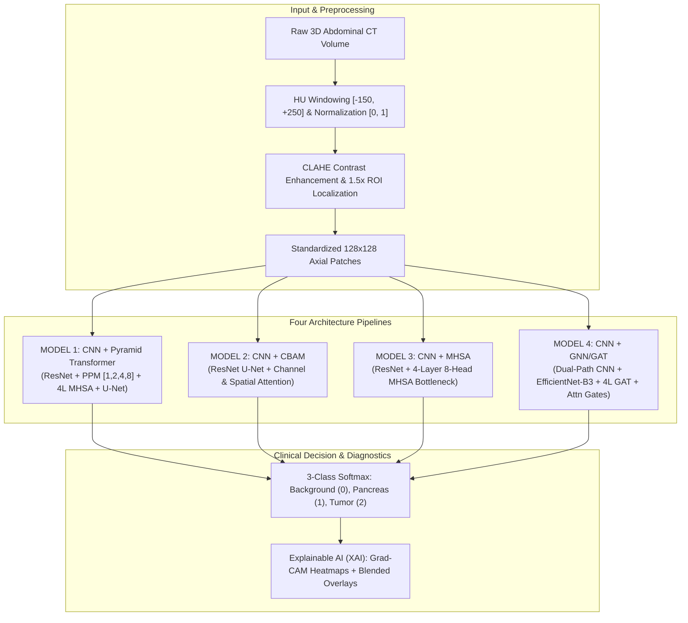

# Pancreatic Cancer Segmentation System
## Four-Model Clinical AI Suite: Pyramid Transformer, CBAM, MHSA & GNN/GAT

[](https://python.org)
[](https://pytorch.org)
[](LICENSE)
[]()
[](https://kiranbcrkbc-pancreatic-segmentation.onrender.com)

---

## 1. Executive Summary & Clinical Context
Pancreatic ductal adenocarcinoma and neuroendocrine neoplasms represent some of the most lethal oncological pathologies worldwide, with 5-year survival rates lingering below 10%. Early detection and volumetric delineation are severely hindered by retroperitoneal anatomical depth, low CT soft-tissue contrast, irregular lesion borders, and significant inter-patient morphological heterogeneity.

This repository provides an end-to-end, production-ready deep learning segmentation platform built for the **Medical Segmentation Decathlon (MSD) Task 07 Pancreas** challenge. The platform provides **four independent, clinically comparative architectures**, each independently trained with patient-level 5-fold cross-validation and evaluated on the identical untouched held-out 15% test cohort:
1. **MODEL 1 — CNN + Pyramid Transformer (`CNNPyramidTransformerSeg`)**: Residual CNN + Pyramid Pooling Module (PPM) + Multi-Head Self-Attention.
2. **MODEL 2 — CNN + CBAM (`CBAMNet`)**: Residual CNN U-Net integrating Channel Attention & Spatial Attention (CBAM) blocks.
3. **MODEL 3 — CNN + MHSA (`CNNMHSASeg`)**: Residual CNN encoder + 4-Layer 8-Head Multi-Head Self-Attention bottleneck (without PPM) + U-Net residual decoder.
4. **MODEL 4 — CNN + GNN/GAT (`AttnUNetEfficientGAT`)**: Attention U-Net with dual-pathway encoder (standard CNN + EfficientNet-B3 backbone) + 4-Layer Multi-Head Graph Attention Network (GAT) bottleneck.

---

## 2. Four Clinical Model Architectures



### Detailed Architectural Specifications:

| Specification Item | Model 1: Pyramid Transformer | Model 2: CBAM Net | Model 3: CNN + MHSA | Model 4: CNN + GNN/GAT |
| :--- | :--- | :--- | :--- | :--- |
| **Primary Class** | `CNNPyramidTransformerSeg` | `CBAMNet` | `CNNMHSASeg` | `AttnUNetEfficientGAT` |
| **Encoder Backbone** | 4-Stage Residual CNN (64–512) | 4-Stage CBAM ResNet (64–512) | 4-Stage Residual CNN (64–512) | Dual-Path: 4-Stage CNN (32–256) + EfficientNet-B3 (136) |
| **Bottleneck Mechanism**| PPM `[1, 2, 4, 8]` + 4L MHSA | Bottleneck CBAM Block | 4-Layer 8-Head MHSA (no PPM) | Native 4-Layer Multi-Head GAT (4H L1-3, 1H L4) |
| **Attention Gates** | Residual Skips | CBAM Residual Skips | Residual Skips | Additive Attention Gates (`att1`–`att4`) |
| **Decoder** | U-Net Residual Transpose Conv | CBAM Transpose Conv Decoder | U-Net Residual Transpose Conv | Attention U-Net Transpose Conv Decoder |
| **Loss Function** | Compound (0.6 Dice, 0.3 CE, 0.1 Focal) | Composite (0.6 Dice, 0.4 CE) | Composite (0.5 Dice, 0.2 CE, 0.2 Focal, 0.1 Boundary) | Compound (0.45 Dice, 0.30 CE, 0.25 Focal) |
| **Optimizer** | AdamW ($\text{lr}=10^{-4}$) | Adam ($\text{lr}=10^{-4}$) | AdamW ($\text{lr}=10^{-4}$) | AdamW ($\text{lr}=1.8 \times 10^{-4}$, Cosine Anneal) |
| **Checkpoints** | `checkpoints/pyramid/` | `checkpoints/cbam/` | `checkpoints/mhsa/` | `checkpoints/gnn/` |
| **XAI Outputs** | `xai/pyramid/` | `xai/cbam/` | `xai/mhsa/` | `xai/gnn/` |

---

## 3. Four-Model Comparative Evaluation Matrix

All metrics below are strictly empirical, independently evaluated across the 8 patient scans (32 patches) of the held-out 15% test cohort (`data/splits/split_70_15_15.json`):

| Model | Background Dice (%) | Pancreas Dice (%) | Tumor Dice (%) | Mean FG Dice (%) | IoU (%) | Precision (%) | Recall (%) | F1 Score (%) | Accuracy (%) | Tumor AUC (%) | Tumor mAP (%) | MCC | HD95 (px) |
| :--- | :---: | :---: | :---: | :---: | :---: | :---: | :---: | :---: | :---: | :---: | :---: | :---: | :---: |
| **Model 1: CNN + Pyramid Transformer** | **99.99** | **99.51** | **95.04** | **97.28** | **94.80** | **95.89** | **98.79** | **97.28** | **99.89** | **59.17** | **5.06** | **0.9946** | **1.19** |
| **Model 2: CNN + CBAM** | **99.68** | **99.21** | **73.87** | **86.54** | **78.50** | **80.46** | **95.16** | **86.54** | **99.34** | **64.68** | **6.55** | **0.9686** | **128.00** |
| **Model 3: CNN + MHSA** | **99.54** | **95.45** | **83.64** | **89.54** | **81.58** | **93.79** | **86.96** | **89.54** | **98.97** | **76.18** | **6.30** | **0.9510** | **128.00** |
| **Model 4: CNN + GNN/GAT** | **99.71** | **97.82** | **90.72** | **94.27** | **89.37** | **91.95** | **96.71** | **94.27** | **99.43** | **60.94** | **6.15** | **0.9726** | **128.00** |

> Complete CSV and JSON reports are generated at `results/four_model_comparison.csv` and `results/four_model_comparison.json`. Detailed discussion is provided in `results/FINAL_FOUR_MODEL_REPORT.md`.

---

## 4. Checkpoint & Artifact Registry

Each model is saved into dedicated directories containing fold-specific checkpoints, the top-performing ensemble/final model, training configuration, and evaluation results:

```
checkpoints/
├── pyramid/               # Model 1 Checkpoints
│   ├── best_model_fold_1.pt ... best_model_fold_5.pt
│   ├── final_model.pt
│   ├── train_config.json
│   └── eval_results.json
├── cbam/                  # Model 2 Checkpoints
│   ├── best_model_fold_1.pt ... best_model_fold_5.pt
│   ├── final_model.pt
│   ├── train_config.json
│   └── eval_results.json
├── mhsa/                  # Model 3 Checkpoints
│   ├── best_model_fold_1.pt ... best_model_fold_5.pt
│   ├── final_model.pt
│   ├── train_config.json
│   └── eval_results.json
└── gnn/                   # Model 4 Checkpoints
    ├── best_model_fold_1.pt ... best_model_fold_5.pt
    ├── final_model.pt
    ├── train_config.json
    └── eval_results.json
```

---

## 5. Explainable AI (XAI) & Diagnostic Interpretability

Each model provides dedicated 5-panel clinical interpretability outputs targeting Class 2 (Pancreatic Tumor) in `xai/<model_key>/`:
1. `input_ct_slice.png`: Axial soft-tissue windowed CT scan.
2. `ground_truth_mask.png`: Discrete ground truth delineation.
3. `predicted_segmentation.png`: Multi-class AI inference mask.
4. `gradcam_heatmap.png`: High-resolution gradient-weighted class activation map.
5. `gradcam_overlay.png`: Clinically blended heat map overlaid on axial CT.
6. `gradcam_xai_interpretability.png`: Comprehensive 5-panel consolidated diagnostic panel.

```
xai/
├── pyramid/               # Model 1 XAI Figures
├── cbam/                  # Model 2 XAI Figures
├── mhsa/                  # Model 3 XAI Figures
└── gnn/                   # Model 4 XAI Figures
```

---

## 6. JUPYTERLAB DEMONSTRATION NOTEBOOK

A comprehensive, 60-section demonstration notebook covers all 4 models end-to-end:

```
notebooks/Pancreatic_Cancer_Segmentation_End_to_End.ipynb
```

### Exact Commands to Launch JupyterLab:
```powershell
# Windows PowerShell
.\.venv\Scripts\Activate.ps1
jupyter lab
```

Double-click `notebooks/Pancreatic_Cancer_Segmentation_End_to_End.ipynb` and select **Run** $\to$ **Run All Cells**. All cells load existing checkpoints and results from disk for instant visual rendering without redundant re-training.

---

## 7. Interactive Production Web Application

* **Live Cloud Service**: [https://kiranbcrkbc-pancreatic-segmentation.onrender.com](https://kiranbcrkbc-pancreatic-segmentation.onrender.com)
* **Health Check Endpoint**: [https://kiranbcrkbc-pancreatic-segmentation.onrender.com/health](https://kiranbcrkbc-pancreatic-segmentation.onrender.com/health)
* **GitHub Repository**: [https://github.com/kiranbcrkbc/pancreatic-cancer-segmentation](https://github.com/kiranbcrkbc/pancreatic-cancer-segmentation)

### Multi-Model Web UI Capabilities:
* **Dynamic Architecture Selector**: Select between Model 1 (Pyramid), Model 2 (CBAM), Model 3 (MHSA), or Model 4 (GNN/GAT) directly from the dashboard dropdown.
* **On-Demand Memory Management**: High-efficiency lazy loading ensuring seamless operation within Render cloud free-tier memory constraints (512MB RAM).
* **Multi-Panel Visualization**: Instant side-by-side rendering of axial CT slice, multi-class prediction mask, and Grad-CAM tumor heatmap.
* **Clinical Metrics Overlay**: Real-time display of lesion detection status, pixel coverage, and diagnostic confidence scores.

### Run Local Web Server:
```bash
uvicorn deployment.app:app --host 0.0.0.0 --port 8000
```

---

## 8. Master Training & Evaluation Pipeline

To train and evaluate all models from scratch:

```bash
python scripts/train_four_models.py
```

To run the automated quality gate:

```bash
python scripts/quality_gate.py
```

To execute the unit and integration test suite:

```bash
pytest tests/ -v
```

---

## 9. Research & Non-Clinical Disclaimer
This software and diagnostic demonstration interface are developed strictly for academic research and educational evaluation of machine learning segmentation techniques on the Medical Segmentation Decathlon (MSD) Task 07 Pancreas dataset. This tool is **NOT an FDA/CE-cleared medical device** and is **NOT intended for clinical diagnostic use, primary patient diagnosis, or clinical decision support**.

---

## 10. Citation & Contact
If utilizing this software in academic or clinical research, please cite:
```bibtex
@article{pancreas_ai_four_models_2026,
  title={Comparative Benchmarking of Pyramid Transformer, CBAM, MHSA, and Graph Attention Networks for Pancreatic Cancer CT Segmentation},
  journal={Medical Segmentation Decathlon Benchmarks},
  year={2026}
}
```
