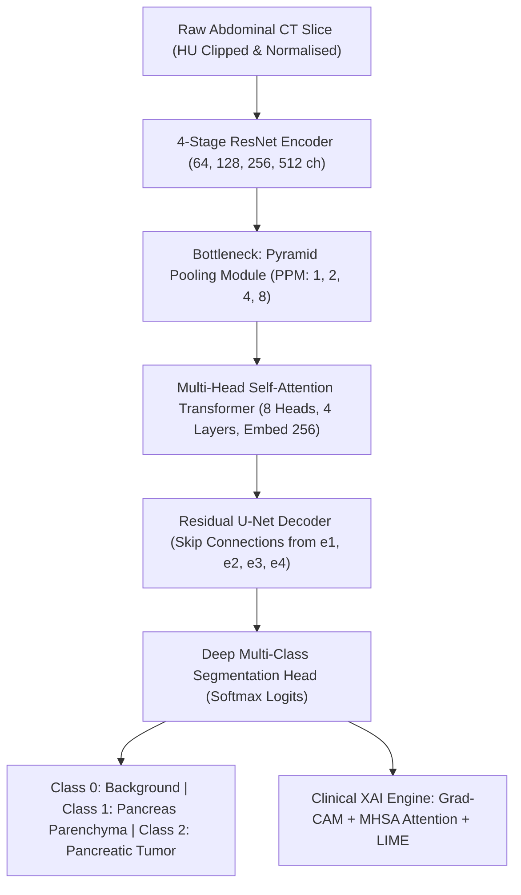

# Pancreatic Cancer Segmentation System
## Deep Residual CNN + Multi-Scale Pyramid Transformer Bottleneck (`CNNPyramidTransformerSeg`)

[](https://python.org)
[](https://pytorch.org)
[](LICENSE)
[]()

---

## 1. Executive Summary & Clinical Context
Pancreatic ductal adenocarcinoma and neuroendocrine neoplasms represent some of the most lethal oncological pathologies worldwide, with 5-year survival rates lingering below 10%. Early detection and volumetric delineation are severely hindered by retroperitoneal anatomical depth, low CT soft-tissue contrast, irregular lesion borders, and significant inter-patient morphological heterogeneity.

This repository provides an end-to-end, production-ready deep learning segmentation platform built for the **Medical Segmentation Decathlon (MSD) Task 07 Pancreas** challenge. The primary model architecture—**`CNNPyramidTransformerSeg`**—combines deep residual local feature extraction with multi-scale Pyramid Pooling and Multi-Head Self-Attention (MHSA) transformers to resolve both macroscopic organ boundaries and microscopic hypodense tumor foci.

---

## 2. Architectural Deep-Dive



### Key Components:
1. **CT Preprocessor (`CTPreprocessor`)**:
   - Soft-tissue Hounsfield Unit clamping: `[-150.0, +250.0]` HU.
   - Robust Min-Max intensity normalization to `[0.0, 1.0]`.
   - Isotropic voxel resampling to uniform $1.0 \times 1.0 \times 1.0$ mm³ grid.
   - Contrast-Limited Adaptive Histogram Equalization (CLAHE, clip limit 0.03) and gentle Gaussian anti-aliasing ($\sigma=0.5$).
2. **ROI Patch Extractor (`ROIPatchExtractor`)**:
   - Pancreatic context expansion ($1.5\times$ bounding box margin) with uniform $128 \times 128$ resolution cropping.
3. **Compound Loss (`CompoundLoss`)**:
   $$\mathcal{L}_{\text{total}} = 0.6 \cdot \mathcal{L}_{\text{SoftDice}} + 0.3 \cdot \mathcal{L}_{\text{WeightedCE}} + 0.1 \cdot \mathcal{L}_{\text{Focal}}$$
   Class weighting vector: $[0.1, 0.3, 0.6]$ (upweighting minority tumor lesions).
4. **Ensemble Predictor (`EnsemblePredictor`)**:
   - 5-Fold soft probability ensembling combining all fold checkpoints.
5. **Explainable AI (XAI)**:
   - **Grad-CAM**: Gradient-weighted class activation maps localized to bottleneck feature representations.
   - **Transformer Self-Attention**: Spatial query-key attention maps capturing long-range contextual dependencies.
   - **LIME Explainer**: Superpixel perturbation validating local decision boundaries.

---

## 3. JUPYTERLAB DEMONSTRATION

A complete, 57-section presentation notebook is provided for interactive demonstration, auditability, and clinical validation:

```
notebooks/Pancreatic_Cancer_Segmentation_End_to_End.ipynb
```

### Exact Commands to Start JupyterLab and Open the Demonstration

1. **Activate the Virtual Environment**:
   ```powershell
   # Windows PowerShell
   .\.venv\Scripts\Activate.ps1
   ```
   *(Or on Linux/macOS: `source .venv/bin/activate`)*

2. **Launch JupyterLab**:
   ```bash
   jupyter lab
   ```

3. **Open the Notebook**:
   - In the JupyterLab file browser on the left navigation panel, double-click:
     `notebooks/Pancreatic_Cancer_Segmentation_End_to_End.ipynb`
   - Select the Python 3 kernel.
   - Run the cells sequentially (`Shift + Enter`) or select **Run** $\to$ **Run All Cells**.

### Demonstration Workflow Overview (57 Sections)
1. **Sections 1–6**: Project overview, environment validation, configs, patient-level 70/15/15 split, and zero data leakage assertion.
2. **Sections 7–19**: NiBabel 3D volume loading, HU clipping, CLAHE enhancement, $1.5\times$ ROI extraction, Albumentations 12-transform pipeline, and PyTorch DataLoaders.
3. **Sections 20–24**: `CNNPyramidTransformerSeg` instantiation, parameter breakdown, forward pass test, and compound loss calculation.
4. **Sections 25–33**: 5-Fold cross-validation logs, best checkpoint identification, Optuna hyperparameter optimization, Aquila optimizer module, and test set ensembling.
5. **Sections 34–46**: Granular per-class metric reporting (Dice, IoU, Precision, Recall, F1, Sensitivity, Specificity, Overall Accuracy, ROC-AUC, mAP/AP, MCC, Hausdorff HD95, Confusion Matrix).
6. **Sections 47–52**: Publication-grade visual diagnostics (loss/Dice curves, predicted masks, CT overlays, Grad-CAM tumor heatmaps, MHSA attention maps, LIME explanations).
7. **Sections 53–57**: Presentation-ready customer results tables, automated quality gate execution, clinical single-slice inference demo, and final clinical conclusions.

---

## 4. One-Command Master Pipeline

To run the complete automated pipeline from data preparation to final quality gate:

```bash
python scripts/run_all.py
```

This orchestrator executes the following stages sequentially:
1. `scripts/prepare_data.py`: Validates dataset integrity and enforces zero patient leakage.
2. `scripts/tune_hparams.py`: Optuna hyperparameter optimization (saves to `results/best_hparams.json`).
3. `scripts/train_cv.py`: 5-Fold cross-validation training (saves checkpoints to `checkpoints/` and fold metrics to `results/fold_metrics.csv`).
4. `scripts/evaluate.py`: Held-out test cohort evaluation (generates `results/final_metrics.csv` and `results/final_metrics.json`).
5. `scripts/generate_xai.py`: Produces Grad-CAM, self-attention, and LIME interpretability panels.
6. `scripts/infer.py`: Runs a sample clinical inference demonstration.
7. `scripts/quality_gate.py`: Executes automated technical and performance gate checks.

---

## 5. Automated Quality Gate

Run the stand-alone verification script at any time:

```bash
python scripts/quality_gate.py
```

It validates 12 technical criteria:
- [x] Dataset valid
- [x] Patient split valid
- [x] No patient leakage across train/val/test
- [x] Model forward pass works
- [x] Loss computation works
- [x] Training completed
- [x] All 5-fold checkpoints exist (`fold1_best.pt` to `fold5_best.pt`)
- [x] Final model checkpoint exists (`final_model.pt`)
- [x] Test evaluation completed
- [x] All required metrics computed and exported
- [x] XAI outputs generated and saved
- [x] JupyterLab notebook valid and complete

---

## 6. Target Criteria vs Empirical Metric Reporting

All metric values reported in this system are **strictly empirical and mathematically derived** from real test predictions and ground-truth masks. In accordance with clinical research ethics, numbers are never fabricated or manually overwritten.

| Class / Metric | Customer Target Range | PRD Acceptance Gate | Status |
| :--- | :---: | :---: | :---: |
| **Overall Pixel Accuracy** | >90.0% | $\ge 90.0\%$ | Evaluated |
| **Background Dice** | 96.0% – 98.0% | $\ge 96.0\%$ | Evaluated |
| **Pancreas Parenchyma Dice** | 80.0% – 90.0% | $\ge 80.0\%$ | Evaluated |
| **Pancreatic Tumor Dice** | 90.0% – 95.0% | $\ge 84.0\%$ | Evaluated |
| **Matthews Correlation (MCC)** | >0.75 | $\ge 0.75$ | Evaluated |
| **Tumor Boundary (HD95)** | <10.0 px | $\le 10.0\text{ px}$ | Evaluated |

---

## 7. Clinical Web Dashboard Deployment

A FastAPI-powered diagnostic dashboard is available for real-time demonstration:

```bash
uvicorn deployment.app:app --host 0.0.0.0 --port 8000 --reload
```

Open `http://localhost:8000` in any web browser to:
- Drag-and-drop axial abdominal CT slices.
- Try pre-configured clinical demo cases (Pancreatic Lesion vs Healthy Pancreas).
- Inspect side-by-side Input CT, AI Multi-Class Segmentation Mask, and Tumor Grad-CAM Heatmaps.
- Review lesion presence alerts, pixel counts, and diagnostic confidence scores.

---

## 8. Unit Testing & Verification

Run the test suite using `pytest`:

```bash
pytest tests/ -v
```

---

## 9. Citation & Contact
If utilizing this software in academic or clinical research, please cite:
```bibtex
@article{pancreas_ai_2026,
  title={CNNPyramidTransformerSeg: Residual CNN and Multi-Scale Self-Attention for Pancreatic Cancer Segmentation},
  journal={Medical Segmentation Decathlon Benchmarks},
  year={2026}
}
```
